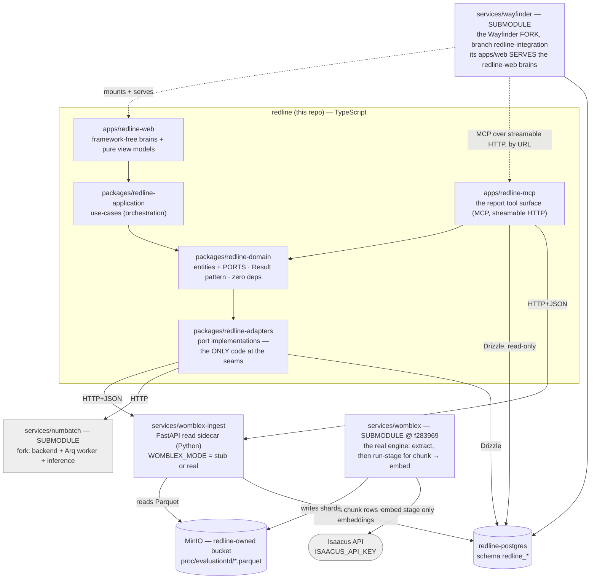
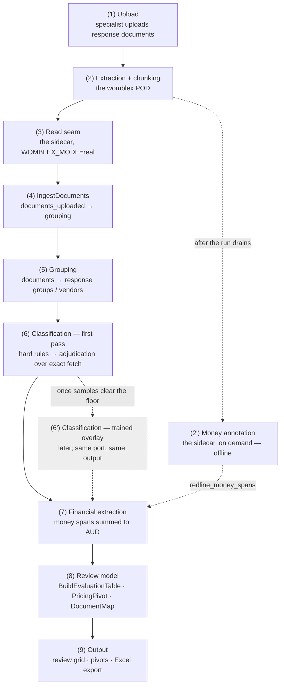

# redline — Architecture & Dataflow (target state)

> **Status:** ground-truth reference · supersedes the per-thread docs and the
> iteration delivery plans, all deleted. Durable design rationale that is not a
> single decision lives in [`design-principles.md`](./design-principles.md).
>
> This is the single source of truth for **what redline is, what it depends on,
> and how data moves through it**. Its companion is
> [`delivery-plan.md`](./delivery-plan.md), the single source of truth for **what
> is left to build** — design lives here, tracking lives there, and neither
> restates the other.
>
> It is written against the *actual* behaviour of
> the upstream engines (womblex is vendored as a submodule at `services/womblex`,
> pinned to `f283969`; Numbatch is a submodule at `services/numbatch`), not against
> aspiration. Where an earlier assumption proved false, the correction is stated
> plainly under **Corrections to earlier assumptions**.

---

## 1. What redline is

redline is a **procurement-evaluation adapter**. A specialist uploads a tender's
response documents, defines the evaluation criteria (requirements) in plain
language, and redline sorts each document against those criteria — surfacing a
review grid, pricing pivots, and an Excel export — with provenance back to the
source text.

redline is **not** a document-extraction engine, a classifier, or an embedding
model. It **composes three upstream systems** over runtime seams and owns only:

- the **domain** (evaluations, requirements, the comprehension lens, responses);
- the **orchestration** (use-cases that drive documents through the pipeline);
- the **control surface** (the review grid, pivots, export, workflow UI);
- its **own** MinIO bucket and Postgres schema.

Everything heavy — OCR, chunking, embeddings, trained classification, LLM
adjudication — lives behind a seam in an upstream system or an external API.

### The three upstream systems

| System | What it is | How redline consumes it |
|---|---|---|
| **womblex** (`services/womblex`, submodule @ `v0.3.0`) | Python document-extraction pipeline: detect → extract → (redact) → chunk → (embed / enrich / pii), plus the offline **`money`** annotation op (added `v0.3.0`). Writes **Parquet shards** to object storage. | As a **worker pod** that lands shards in MinIO, plus a thin **FastAPI read sidecar** (`services/womblex-ingest`) that reads those shards and serves **JSON**. redline's TypeScript never links a Parquet reader. The sidecar also carries the **money-stage invocation** (`run_money_stage` / the `money` compose profile). |
| **Numbatch** (`services/numbatch`, submodule @ `72bcead`) | Python no-code multi-topic classifier: curated samples → LoRA adapter → per-document classification. FastAPI backend + Arq worker + DB-free inference service. Ships a corrections API with an append-only audit trail, topic-scoped sample dedupe, and user-controlled adapter activation with replay comparison. | As a **backend+worker+inference stack** (SvelteKit frontend excluded — redline owns its UI), built from the fork's own Dockerfiles. A redline requirement ↔ a Numbatch topic; a requirement set ↔ a profile. redline **extends** the backend for financial-figure extraction via `services/numbatch-extension/`. |
| **Isaacus** (external SaaS API) | The Kanon model family: `kanon-2-embedder` (retrieval embeddings), `kanon-2-enricher` (entity/graph enrichment + AI chunking), `kanon-universal-classifier`, `kanon-answer-extractor`. | **Only** through womblex's embed/enrich stages. redline never calls Isaacus directly. Requires `ISAACUS_API_KEY`. |

---

## 2. The Isaacus boundary

Womblex's stages split cleanly into offline and Isaacus-gated:

| womblex stage | Needs Isaacus? | Produces |
|---|---|---|
| `detect` / `extract` | **No** — PyMuPDF + PaddleOCR/YOLO, all local | `*.elements`, `*.table_cells`, `*.form_fields`, `*._manifest` parquet |
| `redact` | No — local detector | `*.redactions.parquet` |
| **`money`** | **No** — offline, API-free amount recognition (v0.3.0) | **`*.money_spans.parquet`** (one row per amount, exact `Decimal` + currency) + `*.money_columns.parquet` (per-column verdict audit) |
| `chunk` (default) | **Yes** (v0.3.0) — but by a *pre-flight policy gate*, not by any API call: the stage refuses when no key is present even though `semchunk` sizes with a Kanon-2 tokeniser the engine vendors in-tree. See §7.1 | `*.chunks.parquet` |
| `chunk` (AI mode, `chunking.chunking_model` set) | Yes — enricher-driven boundaries | `*.chunks.parquet` (better boundaries) |
| `pii` | No — graph-driven (needs enrich) or a local MiniLM backstop | `*.pii_spans`, `*.clean_text` parquet |
| **`embed`** | **YES** — `kanon-2-embedder` via `client.embeddings.create` | **`*.embeddings.parquet`** |
| `enrich` | **YES** — `kanon-2-enricher` | `*.enrichment_*`, `*.graph_edges`, `*.entity_links` parquet |

**Consequence for redline's classification leg (settled 2026-07-27):**
redline's cold-start classification reads womblex's chunks/embeddings from the
`redline_` store. The chunk *and* embed stages are Isaacus-gated. Therefore:

- **A usable corpus requires `ISAACUS_API_KEY`.** Without it, `chunk`/`embed`
  never run, no chunk rows land in the store, and there is nothing to classify
  over. This is a hard dependency, not a degraded mode. (Note the *current*
  cold-start path adjudicates over exact/structural fetch and does not itself run
  a nearest-neighbour match — but it still needs the chunk rows the Isaacus-gated
  stages produce.)
- **Air-gap / offline operation is a non-goal for redline.** Earlier docs carried
  an "Isaacus-optional / air-gapped" posture (a hangover from womblex's own edge
  modes and Wayfinder's air-gap validation). redline does not pursue it — a
  deployment that cannot reach Isaacus cannot retrieve, which is the whole
  first-pass. Settled 2026-07-27; the
  `EnrichmentMode.OFFLINE` machinery, the air-gap tests and the Isaacus on/off
  toggle have been removed.
- The only genuinely offline concern is **redline's own infra** (its MinIO/Postgres
  are its own, config-driven, never a hardcoded Wayfinder endpoint).
  That is unrelated to the Isaacus dependency.
- **Chunking is also Isaacus-gated (v0.3.0) — by policy, not by capability.** An
  earlier revision recorded the default chunk stage as offline; a later one blamed
  an API-only tokeniser. Both are wrong: the engine refuses the whole stage without
  a key (a network-free pre-flight check) while vendoring the Kanon-2 tokeniser
  in-tree. The practical effect is unchanged — chunks *and* embeddings both require
  `ISAACUS_API_KEY`, and only `extract`/`table_cells`/`redact`/`money` are offline —
  but the reason matters for any upstream conversation. See §7.1.

---

## 3. Component map



**Reading the map.** Each layer, and what the diagram compresses:

- **`apps/redline-web`** — the control surface: workflow, review grid, pricing
  pivots, Excel export. Served by the forked Wayfinder; **no Wayfinder imports
  leak back** into these packages.
- **`apps/redline-mcp`** — the **report tool surface**: the same read ports, served
  as an MCP server so a report-assembler LLM can call them. See §5 invariant 7 for
  what it does and does not expose. It is a *process with a URL*, not a library —
  Wayfinder's MCP client speaks SSE and streamable HTTP only (no stdio) and
  addresses servers by URL, so it cannot live in `redline-adapters` (a library) and
  must not live in the fork (which would make redline's own store reachable only
  through Wayfinder).
- **`packages/redline-application`** — `IngestDocuments`, `ColdStartClassifier`,
  `ClassifyWithHardRules`, `AdjudicateUnclear`, `ClassifyResponseGroup`,
  `MoneySpanFinancialExtractor`, `BuildEvaluationTable`, `DocumentMap`, pivots.
- **`packages/redline-domain`** — entities plus the ports:
  `IProcurementExtractionReader`, `IChunkStore`, `IProcurementClassifier`,
  `IClassificationLensReader`, `IClassificationLensWriter`, `IFinancialExtractor`,
  `IMoneySpanStore`, `IAdjudicator`, `ILanguageModel`, `IEvaluationRepository`.
  The lens seam's adapters are `DrizzleClassificationLensReader` and
  `DrizzleClassificationLensWriter`, both over the four lens tables.
- **`packages/redline-adapters`** — each seam is "as if C":
  `womblex/` speaks HTTP+JSON to the sidecar, `numbatch/` HTTP to the Numbatch
  backend (classify + finance), `persistence/` Drizzle to `redline_` Postgres —
  including the `DrizzleChunkStore` `IChunkStore` reader over `redline_chunks`
  (the sidecar writes that table; this adapter reads it — see §4/§5).
- **`redline_chunks`** is the chunk store, **written by the sidecar's ingest**:
  chunk rows + provenance + the embedding as data.
- **`services/womblex`** is built from its **own** Dockerfile and run through its
  **own** cloud runner (Postgres job queue, scalable worker, native S3 staging).
  Only its `embed` stage reaches Isaacus.
- **The `money` op runs on demand like any other stage** (`run-stage --stage
  money`, the `stage` compose profile): it stages an evaluation's shards down,
  runs womblex's `money_shards()`, and publishes `*.money_spans` /
  `*.money_columns` back — offline, no Isaacus. See §4 step (2').

**The fork (`services/wayfinder`).** Its `apps/web` serves the
redline-web brains and view models inside Wayfinder's chrome, auth and router,
resolving `@redline/*` as workspace packages (`../../apps/*`, `../../packages/*`
globs) exactly as it resolves `@rbrasier/*`. **The mount lives only here**, never
in redline's tree; `validate.sh` #15 keeps the checkout on that branch.

As built: the `evaluation` tRPC router (read-side `list` / `reviewGrid` /
`pricingPivot` / `workbook` / `document`, plus the create half — `stagedCorpora`
/ `stagedDocuments` and the router's first mutation, `create`);
`container-redline.ts` (`buildRedlineModule` → `WorkflowController` behind
`ctx.container.redline.workflowController`); the `/evaluations` index,
`/evaluations/new`, the `/evaluations/:id/{review,pivots,grouping}` routes plus
`/evaluations/:id/documents/:documentId` — the document view every review row's
source deep-link points at — with `"use client"` surfaces that render the view
models (grouping is a read-side landing) — all mirroring the fork's own extraction
feature. Every route gates in the page as well as in the procedure, calling
`notFound()` without the key. For the index that is because the sidebar entry
pointing at it is hidden by the same rule, and a discoverable surface that
renders an empty list to someone who may not see it would contradict that; for
the document route it is because the URL carries a document id, so a shell that
renders and only then fails to load would confirm which ids exist. The controller's
ports cross `container-redline`'s boundary as **injected** dependencies. The
repository, extraction-reader, money `IFinancialExtractor`, `DrizzleChunkStore`,
`HttpAdjudicator` and `DrizzleStagedCorpusReader` adapters all exist; the auth
gates (`reviewProcedure`, `createProcedure`) and the served-fork Playwright specs
are merged.

**Three test layers, not two.** The brains and view models are proven
framework-free under `apps/redline-web/`; the Playwright specs prove the served
routes but skip until a real corpus has run (delivery-plan §4 item 3). Between
them, the fork's own vitest suite mounts the `"use client"` components under
jsdom against a fake `trpc` query and asserts the rows and columns they render,
so a break in the core→DOM binding fails without a browser or a corpus. `jsdom`
is a dev dependency of the fork's `apps/web` for exactly those two files; every
other test there still runs under node.

**Two keys, not one.** Reviewing and creating are separate permissions:
`evaluation:review` opens the grid, the pivots and the export;
`evaluation:create` starts a tender and, with it, discloses which corpora are
staged. The fork splits `extraction:author` from `extraction:run` the same way.
Power Users hold both out of the box, admins pass on the wildcard.

**An evaluation's id is its corpus's id.** `CreateEvaluation` never mints one.
The same string addresses the corpus in object storage (`proc/{evaluationId}/`),
in `redline_chunks.evaluation_id` and at the sidecar
(`/extractions/{evaluation_id}/{document_id}`), so a fresh id would produce an
evaluation whose documents cannot be read — which is exactly what a retyped
manifest id used to do, silently, until classification returned nothing.
`IStagedCorpusReader` exists to make that a choice rather than a transcription:
it lists what the load path has already staged, with an opening-passage preview
so an opaque womblex `source_hash` is choosable. It is deliberately not on
`IChunkStore` — that port is the classifier's provenance-addressed fetch, keyed
by an evaluation that already exists; this one answers the question asked
*before* there is one.

**How an evaluation reaches its lens.** `ClassificationRequest` carries no lens,
so a classifier holding one as constructor state could serve only one evaluation
— fatal at a process-wide memoised `getContainer()`. `IClassificationLensReader`
(`readLens({ evaluationId, documentIds }) → Result<{ topics, ruleSet, candidates }>`)
is the route: `ColdStartClassifier` takes `{ chunkStore, adjudicator, lensReader }`
and resolves the lens **inside** `classifyResponseGroup`, which makes it a
legitimate process-lifetime singleton. `IProcurementClassifier` is unchanged, so
port interchangeability holds (D2) and no consumer moved. `topics` and `ruleSet`
are evaluation-scoped through the lens↔evaluation binding; `candidates` are
derived per call from the request's `documentIds` — identifier tokens, never
prose. The trained overlay takes the same treatment when it re-enters.

**The lens is persisted.** `DrizzleClassificationLensReader` reads it from four
`redline_` tables — `redline_lenses`, `redline_topics` (id, name, definition),
`redline_hard_rules` and `redline_lens_bindings` — so the reader has a real
adapter behind it. Topics and rules come from the store in their stored order
(topic `position`, rule `declaration_order`, the latter load-bearing as the
**tie-break**: `evaluateHardRules` takes the more specific pattern first
whichever order it was declared in, and falls back to declaration order only
between equally specific matches); `candidates` are derived per call by an
identifier-token pre-pass over
`IProcurementExtractionReader.readElements`, which is the adapter's second
collaborator. Cold-start definition text is **redline-owned**, so this
works with no Numbatch deployed. `IClassificationLensWriter` /
`DrizzleClassificationLensWriter` is the write half: the whole lens goes in one
transaction (a half-written lens is one the reader rejects), array order becomes
`position` / `declaration_order` so the caller numbers nothing, and a re-save
replaces and rebinds so a seeding run is repeatable. It is a *seeding* surface,
not an authoring one — no editing, no versioning; that stays deferred. Note
`redline_topics.id` is a global primary key, so a topic belongs to exactly one
lens. The redline↔fork `ILanguageModel`
bridge and the `getContainer()` call are built too: `redline-language-model.ts`
maps redline's `summarise` onto Wayfinder's `generateText` (never
`generateObject`, which would need a schema to carry one paragraph), and
`resolveRedlineModule` binds all six ports to their production adapters from
`REDLINE_*` config. With `REDLINE_DATABASE_URL` unset it returns null and the
fork boots as plain Wayfinder with the mount unavailable, so redline's absence
never fails Wayfinder's fail-fast env parse. Running both stacks locally is
[`guides/two-stack-local-run.md`](./guides/two-stack-local-run.md).

**How an evaluation gets created.** From the browser, at `/evaluations/new`:
`CreateEvaluation` takes a picked staged corpus, its documents with a brand
against each, and the fields the responses are read against, and writes the
evaluation, its vendors, its response groups and its lens. Everything is
validated and composed *before* anything is written, because the repository's
saves are upserts — creating twice over one corpus must return `ALREADY_EXISTS`
rather than silently overwrite the first. One group per brand: the review grid
delineates by brand, and a document may be claimed by only one group, since
`assignDocument` moves rather than copies. The lens is written **last**: its
binding row references the evaluation, so the evaluation must exist first, and
the lens must exist before classification or the reader resolves `NOT_FOUND`. It
carries **no hard rules** — none can honestly be written before anyone has seen
how these fields land on this corpus — so every field goes to adjudication.

The create half (`stagedCorpusReader`, `lensWriter`) is therefore **on**
`RedlineModule`, reversing the earlier decision to keep every write part off it.
What is still script-only is the *run*: `scripts/seed-redline-evaluation.ts`
reads a corpus manifest and drives `IngestDocuments` → `saveLens` →
`AssignDocumentsToGroups` → `BuildEvaluationTable`, printing the evaluation id
that opens the review grid and feeds `E2E_REDLINE_EVALUATION_ID`. It stays the
only path that can write a lens *with* hard rules, and the deliberate fallback
for de-risking a live run without a browser (delivery-plan §2 item 1).

### Why womblex is split into a pod + a sidecar

- **The engine** (`services/womblex`, the submodule) is heavier than the API
  layer: PyMuPDF, OCR (`engine: paddleocr`, implemented by `rapidocr-onnxruntime`),
  YOLO layout, the Kanon tokeniser, model weights (multi-hundred-MB). It **can**
  run from its own image, built from the submodule's `Dockerfile`, so its
  lifecycle and resource profile *can* be decoupled from the API layer when a
  deployment wants that. It **is not required to be** — co-locating the engine and
  the sidecar on one appropriately-sized host is a valid topology (the sidecar
  image is `python:3.12-slim`, inside womblex's own 3.11/3.12 support, so the
  engine installs alongside it). Its only seam to the rest of the stack is
  **object storage** either way — it writes shards, nothing reads back
  into it. redline does not wrap the engine: batching, retry, horizontal scale-out
  and staging are the engine's own (`cloud/worker.py`, `store/remote.py`), driven
  through its `enqueue` / `worker` CLI, and are there to be used *if* the corpus
  justifies scaling out — not a precondition for running at all.
- **The sidecar** (`services/womblex-ingest`) is a lightweight FastAPI app that
  **reads** the engine's Parquet shards from object storage and serves them as
  JSON so redline's TypeScript never links a Parquet reader.
  `WOMBLEX_MODE` selects `stub` (a deterministic, dependency-free test double for
  fast CI + the adapter contract) or `real` (reads the engine's actual shards).
- **Whether the engine and sidecar are one deployment or two** (a one-shot job, a
  scaled worker fleet, a co-located process) is a **deployment choice, not a code
  choice** — the seam is object storage, and what backs that storage (an S3
  bucket, or an AWS-managed equivalent) is itself config. The code
  is architected to make co-location *possible*, not to *require* a shared local
  filesystem.

---

## 4. End-to-end dataflow



**(1) Upload.** Files land in MinIO (the redline bucket) via redline-web.

**(2) Extraction + chunking — the womblex pod.** Over the evaluation's documents:

| Stage | Output | Gate |
|---|---|---|
| `womblex extract` | `*.elements` / `*.table_cells` / `*.form_fields` / `*._manifest` | — |
| `womblex chunk` | `*.chunks.parquet` | Isaacus-gated (a policy refusal — §7.1) |
| `womblex embed` | `*.embeddings.parquet` | only with `ISAACUS_API_KEY` |

NB: `womblex run`/`worker` persists **extraction shards only** — it computes
chunking when `chunking.enabled` and then discards it, because
`operations/persist.py` hands `write_results` just the extraction. Every
downstream pass is therefore a separate one over the run's shard prefix, and
`womblex run-stage` (`f283969`) is that pass: it lists one sidecar class, stages a
unit down, calls the unchanged `*_shards()` and publishes the declared outputs
back — all of them or none. It covers normalise, spellfix, chunk, money, enrich,
embed, link, pii, graph-refresh and quality; ordering between them is the
caller's. Run it through the `stage` compose profile. All shards land under
`proc/{evaluationId}/` (`batch-NNNN.<role>.parquet`). `source_hash` (SHA-256 of
the source bytes) is the document identity throughout.

**(2') Money annotation — the sidecar, on demand (v0.3.0).** Not part of `womblex
run`/`worker` (offline, API-free, no ordering dependency), so it runs after a run
drains — the same lifecycle as `womblex finalize`. `womblex money --shards` takes
a *local* dir but the shards live in object storage, so
`services/womblex-ingest/.../money_stage.py` (`run_money_stage`) is the stage-in /
run / stage-out step: it downloads each batch's `*.elements` + `*.table_cells`,
runs womblex's own `money_shards()` (config sourced from
`infra/womblex/redline.yaml` via `WOMBLEX_CONFIG` — the tuning is never restated),
and publishes `*.money_spans.parquet` + `*.money_columns.parquet` back under
`proc/{evaluationId}/documents/`. Runnable via the `money` compose profile
(`compose --profile money run --rm money --evaluation-id <id>`), which builds the
sidecar Dockerfile's `womblex` target (the read seam keeps the light `sidecar`
target).

Publishing is not the last step: `run_money_stage` then **loads** the spans into
`redline_money_spans` off the same scratch dir
(`money_span_store.py` → `money_span_store_postgres.py`, wired when
`REDLINE_DATABASE_URL` is set), which is what makes them readable through
`IMoneySpanStore`. **The span lands uninterpreted** — womblex's
`MONEY_SPANS_SCHEMA` copied across column for column, all **three loci**
(`narrative` character offsets, `table_cell` and `sheet_cell` anchors, exactly one
anchor group non-null per row and `locus` discriminating), the qualifiers womblex
refuses to fold into `value` (`modifier`, `multiplier`, `negative`) and the
`range_group`/`range_role` pairing of a range's endpoints. These are *financial
expressions*, not prices: which requirement a span belongs to, what it rolls up to
and whether it is a price at all are readings, and every reading belongs above the
store. A writer that decided any of them would need a second writer for the next
financial-data type. No span id is stable across a re-annotation, so a load
**replaces** the evaluation's spans rather than upserting them — at evaluation
scope, not per document, because a document can re-annotate to *zero* spans (add a
veto term and a column stops being money) and a per-document replace would never
visit it, leaving a costing in the grid that no longer exists. An evaluation with
no sidecars at all is left untouched: that is "the stage never ran here", not
"it found nothing".

**(3) Read seam — the sidecar (`WOMBLEX_MODE=real`).**

| Route | Behaviour |
|---|---|
| `POST /ingest` | reads the pod's shards, maps womblex's schema → the JSON read model, writes `{source_hash}.extraction.json` + `.embeddings.json` beside the shards (durable across restart), **and** — when a `redline_` DSN is wired — projects each document's chunk rows + embeddings into `redline_chunks`, addressable by provenance |
| `GET /extractions/{eval}/{doc}` | `{ documentId, elements[], chunks[], tableCells[] }` |
| `GET /embeddings/{eval}/{doc}` | `{ documentId, model, dimensions, vectors[] }` |
| `POST /embeddings/query {text}` | `{ model, dimensions, values[] }` (query vector) |

Extraction provenance stays JSON. Bulk vectors do **not** cross to
TypeScript for classification: at real corpus scale (~90k chunks) they are loaded
into the `redline_` store as data and queried in place through `IChunkStore`,
superseding the earlier embeddings-as-JSON path for the classifier. The
`/embeddings` JSON routes remain for the query-embed seam and small
reads. The embeddings are loaded and addressable, but **not yet under a similarity
index** — pgvector/ANN and `findSimilar` are deferred.

**(4) Ingest use-case — redline-application.** `IngestDocuments` confirms every
document reads back through the extraction port, persists the evaluation, and
advances the stage: `documents_uploaded → grouping`.

**(5) Grouping.** The specialist assigns documents to response groups / vendors.

**(6) Classification — first pass, no trained model.** For each
(document, requirement):

1. **Hard rules** resolve deterministically first — rule-claimed documents never
   reach the store or a model (confidence 1, no source chunk).
2. **Adjudication over exact fetch** — for every unclaimed document its passages
   are read verbatim from the `redline_` store by structure
   (`IChunkStore.fetchByStructure({ documentId })`) and an LLM (`IAdjudicator`)
   chooses among the lens topics, emitting a one-sentence rationale. The chosen
   topic's id **is** the `requirementId` it projects to.

NB: the nearest-neighbour **placing** step is deferred — it is
the only leg needing vector similarity search (`findSimilar`), not built this
release. So the cold-start path runs hard rules + adjudication over
exact/structural fetch, **without** a similarity ranking; the `sourceChunkId` is
the chunk the model cited as placing the topic and `sourceElementOrder` is the
element that chunk came from. Output is
`RequirementClassification { documentId, requirementId, confidence, sourceChunkId,
sourceElementOrder, unclassified }` — identical shape whichever path produced it,
with `requirementId` null and `unclassified` set exactly on the no-match rows.
Composed as `ColdStartClassifier` (redline-application), wired behind the port in
`lib/container.ts` (`buildColdStartClassifier`).

**(6') Classification — the trained overlay (later).** Once boundary
decisions accumulate ≥ `MIN_SAMPLES_PER_TOPIC` per topic, a Numbatch LoRA adapter
is trained and activated and subsequent runs use it via `IProcurementClassifier`.
Same port, same output shape — consumers cannot tell.

**(7) Financial extraction — `MoneySpanFinancialExtractor`.** The real
`IFinancialExtractor` reads a document's money spans over `IMoneySpanStore`
(materialised from `*.money_spans.parquet`) and turns them into one AUD figure per
(document, requirement). **This is one reading of the spans, not the shape they are
stored in** — it is a consumer of step (2'), and the report tools (§5 invariant 7)
read the same rows without going through it.

A span carries no requirement, so attribution happens above the store — and it has
**more than one owner**, which is the contradiction this settles. The extractor owns
the *grid's* attribution and says so: a document's spans attach to the **one**
requirement its classification matched with the highest confidence (ties →
lexicographically-least `requirementId`), landing once on that single row so a
document matching more than one requirement never double-counts its priced total in
the per-brand pivot. The report assembler owns the *report's*, over the same rows
through the tools. Neither is the port's business, and the port no longer names an
owner.

What each span *contributes* is `readDocumentMoney` (redline-application), the one
place that reduces spans to a figure. Three rules, each closing a way the earlier
straight sum counted the same money twice or read a bound as exact:

1. **A table prices the document.** When a document carries cell spans its
   narrative spans are excluded — a prose "total contract value" restates the
   schedule it summarises. A document that prices only in prose falls back to
   narrative spans, so a PDF-only tender is not silently free.
2. **A range is one amount**, counted at its upper endpoint rather than as two rows.
   Range groups are keyed by locus and text source as well as by number, because
   womblex restarts the counter per scanned text. Cell spans carry no
   `range_group` at all (`money_stage.py` `_cell_row`), so a range inside a pricing
   table is not detectable here — an upstream limit, recorded rather than papered
   over.
3. **A qualified amount is a bound.** womblex never folds `modifier` into `value`,
   and there is no honest factor to multiply by — inventing one would be quality
   scoring. So a bounded amount still contributes its stated value once (taking a
   ceiling at face value is the same choice as taking a range's upper endpoint), and
   the extraction's `description` states how many amounts are ceilings, floors or
   approximations. The figure is never presented as exact when it is not.

Amounts sum in fixed-point (scaled integers), not float, so the `decimal128(38,4)`
exactness the store carries survives aggregation. Wired behind the port in
`lib/container.ts` (`buildMoneySpanFinancialExtractor`). The Numbatch financial
extension remains the better long-term roll-up (§7 item 4); it satisfies the same
port and would swap in at the same seam.

**(8) Review model.** `BuildEvaluationTable` joins classifications + financials +
provenance into `ProcurementResponse[]`. `PricingPivot` rolls `estimateAud` per
brand/requirement. `DocumentMap` derives the corpus roll-up (per-topic counts,
Clear/Ambiguous split).

**(9) Output.** redline-web renders the review grid + pivots; Excel export writes a
workbook with real Number cells for currency and working deep-links to source
locations.

**(10) Provenance, followed.** Every deep-link the grid and the workbook write
resolves. `WorkflowController.openDocument` reads the cited document's elements
back through `IProcurementExtractionReader` — the same JSON presentation seam the
rest of the read path uses, so no Parquet reader is linked — and
`renderDocumentView` orders them by `elem_order` and resolves the `element` query
parameter to the anchor the served route scrolls to. A cited element the
extraction no longer carries is reported as such rather than silently rendering
the top of the document, which would read as "this is the cited passage" when it
is not.

### The join keys (womblex's real schema — see `services/womblex/docs/extraction.md`)

- **Document identity:** `source_hash` (SHA-256 of source bytes). redline's
  `documentId` == `source_hash`.
- **Element provenance:** `elem_order`, `page`, `text`, `kind`
  (`paragraph`/`heading`/`table`/`form`/`image`/`sheet_cell`/…).
- **Table cells:** children of `kind='table'` elements, joined on
  `(source_hash, parent_elem_order)`. Columns are `row`, `col`, `value`,
  `value_type` — **there is no `is_currency` boolean**; currency is inferred from
  `value_type`.
- **Chunks:** `chunk_index` (0-based per `source_hash`), `text`, `content_type`
  (`narrative` | `table`), `start_char`/`end_char`, nullable `page_start`/`page_end`.
  Chunks join to elements by offset-range overlap, **not** by `elem_order`.
- **Embeddings:** joined to chunks on **`(source_hash, chunk_index, content_type)`**
  in womblex's own store. Columns: `model`, `task`, `dim`, `vector` (float32 list).
  `task` is `retrieval/document` for chunk vectors and **must** be `retrieval/query`
  for query vectors. Note `chunk_index` is a **single monotonic per-document
  sequence spanning narrative *then* table chunks** (womblex re-sequences the
  concatenated list), so `(source_hash, chunk_index)` is already unique across
  content types — the third key never disambiguates a collision (see §7).

redline's JSON wire shape (the sidecar's `records.py` / the domain DTOs) uses
`chunkId = "{source_hash}:{chunk_index}"` and L2-normalises vectors so a
consumer's cosine similarity is a dot product. `content_type` is
carried as provenance, not as part of the join key (see §7).

---

## 5. Seams & contracts (the invariants that must hold)

1. **Parquet→JSON is one-directional and lives in one place.** Only
   `services/womblex-ingest` understands womblex's Parquet schema. It maps
   `source_hash`/`elem_order`/`chunk_index`/cells/vectors into camelCase JSON
   DTOs. The TypeScript adapters are thin, allocation-only mappings.

2. **Object storage is the only seam to the womblex engine.** The engine writes;
   the sidecar reads. Neither imports the other — which is what keeps them
   *separately deployable and freely co-locatable*: the coupling is a storage API
   (S3-shaped), never an in-process link, so the same code runs whether the two
   share a host or not, and what backs the storage (an S3 bucket or an
   AWS-managed equivalent) is config.

3. **Embeddings are loaded into the store as data and never cross to TypeScript.**
   At real corpus scale bulk vectors are projected into `redline_chunks`
   (`embedding jsonb` + `embedding_model`, L2-normalised, keyed on the stable
   `chunkId`), addressable through `IChunkStore` but returned as *rows*, never raw
   vectors — `redline-domain` stays vector-free. Vectors from different
   models are incomparable, so a future similarity match must compare like model
   with like; the vector is present but not yet under a similarity index —
   `pgvector`/ANN and `findSimilar` are deferred. This supersedes the earlier
   embeddings-as-JSON seam, which carried vectors across to TypeScript.

4. **Both classification paths satisfy one port.** `RequirementClassification` is
   produced by the cold-start path (hard rules + adjudication over the store's
   exact/structural fetch) or by the trained Numbatch adapter (overlay); consumers
   cannot tell which ran.

5. **Numbatch is used exactly as built.** `MIN_SAMPLES_PER_TOPIC` is never
   relaxed; the fork is additive-only (backend financial extension, no frontend).

6. **redline owns its infra.** Its MinIO bucket and Postgres schema are its own,
   config-driven, never a hardcoded Wayfinder endpoint. Wayfinder is consumed
   read-only and materialised from a pin.

7. **The report tools expose ports, and expose them uninterpreted.**
   `apps/redline-mcp` serves exactly seven read port methods —
   `IChunkStore.fetchChunks`/`fetchByStructure`,
   `IMoneySpanStore.fetchByDocument`/`fetchByStructure`, and
   `IProcurementExtractionReader.readElements`/`readChunks`/`readTableCells` — over
   **streamable HTTP**, because Wayfinder's MCP client speaks SSE and
   streamable-HTTP only (no stdio) and addresses servers by URL.

   It is hand-built rather than `postgres-mcp` because the ports encode a contract
   a `SELECT` does not: **stable ordering**, so a report assembled twice is the same
   report; **verbatim text**, byte-identical, because that byte-identity *is* the
   provenance claim; and a projection that is exactly the domain row, so
   `redline_chunks.embedding` is never selected (one `SELECT *` at ~90k chunks
   drags every vector across). Each payload reports `returned`/`available`/
   `truncated`, so the row cap protecting the assembler's context is visible rather
   than looking like the whole answer. `postgres-mcp` is still worth having for
   ad-hoc analysis, off this path.

   Two absences are deliberate and bind what a report can claim. There is **no
   similarity search** (`findSimilar` is deferred) and **no graph** (redline's
   womblex profile disables enrichment), so both tools an assembler gets are
   deterministic — exact fetch by key, structural fetch by provenance. It transfers
   facts it is *pointed at*; the pointing is done by classification, not by the
   model roaming the corpus. And **money crosses uninterpreted**: an exact decimal
   `value`, a possibly-unresolved `currency`, and the qualifiers womblex refuses to
   fold in. Step (7)'s reading is not the shape these tools serve.

   In Wayfinder it registers with **`communicatesExternally: false`**. The flag
   classifies whether a server talks *outside* Wayfinder; this one reads redline's
   own Postgres inside the same deployment and sends nothing anywhere. That it reads
   commercial-in-confidence documents is a concern about the data, not about egress,
   and it is what the `false` branch governs — an internal utility under the
   document human-review gate. `true` would register the server but make it **not
   selectable in flows**, which would make the assembler unbuildable.

7. **An evaluation prefix holds many runs; a reader must select one.** The engine
   publishes under `proc/{evaluationId}/runs/run-<timestamp>/documents/`, and a
   re-run adds a directory rather than replacing one — the engine's
   `processing.retention` policy governs its own output root, not this prefix. So
   `proc/{evaluationId}/` accumulates N copies of every shard class, and any
   reader that discovers shards by suffix across the whole prefix returns each row
   N times. The run id is the selector: the stage runner already takes
   `--run-id`, and every read seam needs the same.

   **This invariant is currently violated.** `RealWomblexExtractor.extract` lists
   the whole prefix and concatenates by suffix, so served extractions carry
   duplicated elements and a `elementOrder` that no longer identifies one element.
   Tracked in the delivery plan; recorded here because the invariant is the
   durable half and the fix must not be re-derived.

---

## 6. Repository layout

```
redline/
├── apps/redline-web/              control surface (TypeScript)
├── apps/redline-mcp/              the report tool surface — seven read ports served
│                                  as an MCP server over streamable HTTP, plus its
│                                  Dockerfile (compose profile `report`)
├── packages/
│   ├── redline-domain/            entities + ports (zero deps, Result pattern)
│   ├── redline-application/       use-cases (orchestration)
│   ├── redline-adapters/          port implementations (the only code at the seams)
│   └── redline-shared/            shared kernel
├── services/
│   ├── womblex/                   ◄ SUBMODULE: the real womblex engine @ f283969
│   ├── womblex-ingest/            FastAPI read sidecar (reads MinIO Parquet → JSON)
│   │   ├── src/womblex_ingest/    stub + real extractor, records (wire shape),
│   │   │                          shard_reader (schema map), storage, embedding,
│   │   │                          money_stage (the `money` op invocation) +
│   │   │                          money_span_store[_postgres] (the span load)
│   │   └── Dockerfile             `sidecar` (light) + `womblex` (money) targets
│   ├── numbatch/                  ◄ SUBMODULE: the Numbatch fork @ 72bcead
│   ├── numbatch-extension/        redline's additive overlay (financial_extension
│   │                              + bootstrap-profile.py), grafts onto the fork
│   └── wayfinder/                 ◄ SUBMODULE: the Wayfinder FORK,
│                                  branch redline-integration. apps/web serves
│                                  the redline-web UI; resolves @redline/* as
│                                  workspace packages. Mount lives here only.
│                                  As built: server/routers/evaluation.ts (tRPC;
│                                  read side forwards sort/filter, plus the
│                                  create mutation over a staged corpus),
│                                  lib/container-redline.ts (buildRedlineModule →
│                                  WorkflowController), the
│                                  app/(user)/evaluations index + new + [id]/
│                                  {review,pivots,grouping} routes, [id]/
│                                  documents/[documentId] (the provenance
│                                  deep-link target) + components/evaluation/*
│                                  "use client" surfaces, the sidebar Evaluations
│                                  entry, the evaluation:review auth gate and the
│                                  served-fork Playwright specs.
│                                  Live getContainer() wiring is built:
│                                  resolveRedlineModule + redline-language-model.
├── infra/
│   ├── docker-compose.yml         profiles: ingest | money | womblex | numbatch |
│   │                              redline | report
│   └── womblex/redline.yaml       redline's pipeline config for the engine
├── docs/
│   ├── architecture.md            ◄ THIS FILE — what redline IS (the design truth)
│   ├── delivery-plan.md           what is LEFT TO DO (the tracking truth)
│   ├── design-principles.md       adopted principles + non-goals (durable, not tracking)
│   ├── guides/                    local dev, validation, two-stack run
│   └── reviews/                   dated point-in-time reviews (historical record)
├── scripts/                       vendor-wayfinder, womblex-pod smoke, etc.
├── vendor/wayfinder/              materialised from wayfinder.pin (never committed)
└── validate.sh                    the CI gate
```

### Vendoring / pinning discipline

- **womblex** — git **submodule** at `services/womblex`, pinned to `f283969` — an
  **untagged `main` commit**, deliberately ahead of the last release (`v0.3.0`,
  `b5730b0`), for `womblex run-stage`. See ADR-0021 for why an untagged pin was
  accepted. This is the on-disk source of truth for the Parquet schema the
  sidecar maps, **and the source the engine image is built from** — the `womblex`
  compose profile builds the submodule's own `Dockerfile`. Initialise it with
  `git submodule update --init`; CI checks it out (`submodules: true`). The
  sidecar's `.[womblex]` extra pins the same version for its query embedder;
  `validate.sh` check #13 fails the build if the two drift apart.
- **Numbatch** — git **submodule** at `services/numbatch` (DeepCivic/Numbatch),
  pinned to `72bcead`. Upstream has no tags, so the pin is a SHA rather than a
  tag as womblex's is. The `numbatch` compose profile builds the fork's own
  `infra/docker/*.Dockerfile`s; run all-but-frontend. redline's
  additive overlay is **not** in the submodule — it lives beside it in
  `services/numbatch-extension/` and grafts onto the fork's `app/` + `alembic/`.
  This reverses an earlier choice of a build-time pin for consistency with
  Wayfinder; Wayfinder's pin exists because a submodule drags its package set into
  the pnpm workspace, which is a JavaScript problem Numbatch does not have.
- **Wayfinder** — consumed through **two** distinct seams, mechanism following
  runtime:
  - the **build-time typed-reuse seam** — materialised read-only from
    `wayfinder.pin` into `vendor/wayfinder`, never committed;
  - the **runtime UI-mount seam** — the Wayfinder **fork** as a submodule at
    `services/wayfinder`, tracking branch `redline-integration`. This is a
    submodule redline *runs and edits* (unlike the byte-identical
    womblex/numbatch submodules): the review UI mounts into the fork's `apps/web`,
    which resolves redline's `@redline/*` packages as workspace members. The
    invariant that replaces "never modified" is enforced by `validate.sh` #15:
    the checkout stays on `redline-integration`. The check once also asserted the
    fork's `main` never diverged from rbrasier, protecting a clean upstreaming
    diff; redline builds against johntooth/wayfinder only, so that half was
    removed rather than left policing a relationship we do not have.

---

## 7. Corrections to earlier assumptions

The per-thread docs and dev-iteration plans carried assumptions that the
vendored womblex source contradicts. Recorded here so they are not re-derived:

1. **Chunking IS Isaacus-gated (v0.3.0), but the gate is a policy refusal, not a
   capability limit.** Both earlier framings here were wrong in different
   directions, and reading the pinned engine settles it without a corpus run.

   **The gate is real and blocking.** `run_chunking` (`operations/chunk.py:35-41`)
   and `chunk_shards` (`process/chunk_stage.py:91-98`) each return early when
   `isaacus_available()` is false, writing no `*.chunks.parquet`. A run without
   `ISAACUS_API_KEY` therefore yields extraction shards **but no chunks and no
   embeddings** — not a usable redline deployment (air-gap is a non-goal; see §2).

   **But the reason previously given was wrong.** This section used to say the
   Kanon-2 tokeniser "is API-only (it is not on Hugging Face)". The engine
   **vendors it in-tree** at `src/womblex/_models/kanon-2-tokenizer/`
   (`tokenizer.json`, `vocab.json`, `merges.txt`), and `create_chunker` prefers
   that local copy via `resolve_local_model_path` (`process/chunker.py:152-160`)
   precisely so token counting is offline. `isaacus_available()`
   (`utils/availability.py:16-25`) is a network-free check for the `isaacus`
   package plus a non-empty key — it never attempts to load a tokeniser. So the
   skip is a **pre-flight policy check upstream applies to the whole stage**,
   including plain token chunking that needs no API call. The engine's own config
   comments (and `infra/womblex/redline.yaml`, since corrected) describe the
   chunker's real capability; the gate is what contradicts them. Relaxing it would
   be an upstream change request, not a redline fix — and redline needs the key for
   `embed` regardless, so nothing downstream turns on it.

   Operationally: `womblex run` persists only extract shards; `chunk` and `embed`
   are separate `--shards` commands. Note also that `run` still *computes* chunking
   in-batch when `chunking.enabled` (`batch.py:63-64`) and then drops it at write
   time — `write_batch_parquet` passes only `(doc_id, path, extraction)` to
   `write_results` (`operations/persist.py:18-27`), and `DocumentResult.chunks`
   never reaches a shard — so a keyed run does the work twice. That is wasted CPU
   and wall clock, not Isaacus spend: redline sets no `chunking_model`, so chunking
   is local `semchunk` over the vendored tokeniser. `chunking.enabled: false` for
   the `run` pass avoids it and is safe for `run-stage --stage chunk`, which
   ignores the flag; `womblex chunk --config` refuses outright when it is false
   (`cli/pipeline.py:417-419`), so do not flip it if anyone uses that form.

2. **Retrieval requires Isaacus.** `*.embeddings.parquet` is produced only by
   `kanon-2-embedder` (Isaacus). redline's retrieval classification
   therefore requires `ISAACUS_API_KEY`. The "full pipeline runs offline" framing
   from the earlier air-gap work is retired: it was only ever true up to the chunk
   stage, and air-gap is not a redline goal.

3. **The embeddings join is three keys upstream, but the two-key `chunkId` is
   already unique — no collision exists.** womblex joins vectors to chunks on
   `(source_hash, chunk_index, content_type)`. An earlier revision recorded this
   as an **open finding**: that a document with both narrative and table chunks at
   the same `chunk_index` would collide under redline's two-key
   `chunkId = {source_hash}:{chunk_index}`. **A real 0.3.0 run falsifies that.**
   womblex assigns `chunk_index` as a single monotonic per-document sequence
   spanning narrative *then* table chunks (`process/chunker.py` re-sequences the
   concatenated list: `chunk_index = len(repaired)` — e.g. a real REOI is
   narrative 0–21, table 22–29). So `(source_hash, chunk_index)` is **already
   unique across content types**; the third key never disambiguates a real
   collision. `content_type` is kept as **provenance carried alongside a row**,
   not as part of the join key. No `content_type`-aware `chunkId` and no
   seam-identity change are needed. (Resolved.)

4. **Table cells carry no currency flag, and `value_type` cannot supply one.**
   womblex's `TABLE_CELLS_SCHEMA` is `(source_hash, parent_elem_order, row, col,
   value, rowspan, colspan, value_type)` — joined on `parent_elem_order`, with no
   page column. redline's `TableCellRecord.isCurrency` must be **derived**.

   An earlier revision of this section said to infer it from `value_type`. That is
   **falsified**: `value_type` was always `"text"` at the `v0.2.0` pin this note
   was first written from
   (`ingest/spreadsheet.py:13`, the only literal ever assigned in that engine's
   source), `number_format` is a column of `ELEMENT_SCHEMA` rather than of
   `table_cells` and is left unset, and that engine had no currency capability
   anywhere in `src/`. So `isCurrency` was derived from the **verbatim `value`
   string**, requiring an explicit currency marker — a bare number is not
   currency. Both columns are still read first, so a
   future openpyxl-based reader upgrades the signal with no redline change.

   **Superseded by the `money` op (v0.3.0), and now the real pricing leg.** The
   engine is at `v0.3.0`, whose `money` annotation op recovers currency-typed
   amounts directly — column-evidenced (a bare number whose money-ness comes from
   its header, ~98.7% of amounts) as well as self-evidencing — writing exact
   `Decimal` values and a resolved currency into `*.money_spans.parquet`. redline
   materialises those spans into `redline_money_spans` and its **money
   `IFinancialExtractor` (`MoneySpanFinancialExtractor`) is built** — it sums a
   document's spans over `IMoneySpanStore` into grid AUD (§4 step 7), covering the
   header-evidenced bare-number column. This is the lean-vertical pricing leg,
   replacing the `isCurrency`-at-the-seam derivation above; that
   derivation remains only as a fallback for shards produced without a money
   sidecar. The one upstream limit no config fixes: `classify_column` checks
   vetoes before money terms, so a bare `Hourly Rate` / `Day Rate` column (no
   currency in the header) yields nothing — an upstream change request, not a
   redline fix.

   The larger financial roll-up redline may later want still comes from the
   **Numbatch financial extension**; the money op is the interim, Numbatch-free
   source that keeps the lean vertical off that stack.

5. **There is no `womblex.embed_query` / public embedding helper.**
   `womblex/__init__.py` exports only a docstring and `__version__`. The real query
   embed path is `womblex.analyse.embed.embed_texts([text], isaacus_client, model=…,
   task="retrieval/query")`, with the client from
   `womblex.cli._shared.make_isaacus_client` — it cannot embed offline. The `task`
   matters and is redline's to choose: womblex's own default is
   `retrieval/document`, the *index* side, and a query embedded with it lands in a
   different space from the chunk vectors it is ranked against — degrading silently
   rather than failing. The `model` is read from womblex's own configuration
   (`EmbeddingConfig`, or the deployment's `redline.yaml` via `WOMBLEX_CONFIG`), never
   restated redline-side, so chunks and queries cannot drift onto different models.
   Built in thread 56.

6. **The womblex/Numbatch overlap is not real — closed, no change.** This section
   previously said womblex *exposes* `kanon-universal-classifier` (zero-shot
   classification) and `kanon-answer-extractor` (structured field extraction), and
   asked whether they could retire redline's Numbatch financial extension.

   Reading the engine settles it: **neither model appears anywhere in womblex's
   source.** They are named only in its `README.md` (lines 237–238), in a passage
   describing what the *Isaacus platform* offers. womblex does not wire them, so
   consuming them would mean redline calling Isaacus directly — which §1 forbids.
   Numbatch has no currency capability of its own either. redline's classification
   and financial extraction therefore stay exactly where §1 and §4 put them, and
   the Numbatch financial extension stays genuinely additive.

7. **Three Isaacus-gated stages, not two — and only one is satisfied offline.**
   Earlier text framed the boundary as chunk-and-embed. `enrich` declares the same
   need (`kanon-2-enricher`), and it is now enabled in redline's profile. Of the
   three, only `chunk` is satisfied by a placeholder key, because its tokeniser is
   vendored in-tree and it makes no call; `embed` and `enrich` both spend against
   a real credential. A deployment without an Isaacus account gets extraction and
   chunks and nothing else.

8. **The column-evidenced money path contributed nothing on a native-text
   corpus — measured, not assumed.** The pricing design leans on womblex's finding
   that ~98.7% of its corpus's amounts are bare numbers whose money-ness comes
   from a column header. On the first real procurement corpus (2026-08-06,
   1 REOI + 3 responses) that path recovered **zero**: 42 columns audited, 38
   `insufficient`, 4 `vetoed`, none promoted, because no header carried money
   vocabulary at all. All 65 money spans came from prose with an explicit symbol.

   The reading is about corpus shape rather than the classifier: these documents
   contain no priced tender schedule. It does mean the header/veto vocabulary in
   `infra/womblex/redline.yaml` is **unvalidated by measurement**, and that a
   corpus with real pricing tables is what would validate it.

9. **The OCR-table gates are unexercised on redline's own path.** All four
   documents of the first real corpus extracted `structured` via `native_text`,
   and all 7 tables were native, so the paddleocr-only, deskew-refusal and
   precision-refusal gates never executed. They guard the table-cell
   reconstruction that recovers pricing from scanned tenders — a real consequence
   — and remain unproven here until a scanned corpus runs.

---

## 8. Runtime & environment notes

- womblex requires **Python 3.11/3.12** (its OCR dep `rapidocr-onnxruntime` has no
  wheel on 3.10 or 3.13). The **sidecar image is `python:3.12-slim`** — inside that
  window — so nothing stops `pip install .[womblex]` co-locating the engine with
  the sidecar. The engine **can** run from its own image for resource/lifecycle
  isolation (heavy OCR/YOLO/tokeniser/model runtime, its own cloud runner for
  scale-out), and **can** equally run co-located with the sidecar on one
  appropriately-sized host — the split is a deployment choice, not a code
  constraint. The one interpreter caveat that remains is that a developer's
  `validate.sh` box may run a *newer* interpreter (e.g. 3.13) that womblex's OCR
  wheel does not cover, which is why the engine-touching tests `importorskip` the
  `[womblex]` extra rather than assuming it is present.
- The womblex-ingest sidecar's **real binding** decodes Parquet with `pyarrow`
  (light) — that half runs anywhere pyarrow resolves, independent of whether the
  engine is installed in the same environment. Producing the shards (and any query
  embedding) requires the engine and, for embeddings, Isaacus.
- `ISAACUS_API_KEY` is the single switch that turns the corpus on. Without it:
  extraction shards land, but there are **no chunks and no embeddings** (both the
  `chunk` and `embed` stages are Isaacus-gated in v0.3.0), so nothing lands in the
  `redline_` store and there is nothing to classify over. redline treats that as a
  misconfiguration, not a supported mode (§2, settled 2026-07-27).

---

## 9. Where to look next

- **womblex's real schema & stages:** `services/womblex/docs/extraction.md`,
  `services/womblex/docs/dataflow.md`, `services/womblex/docs/architecture.md`
  (the submodule's own docs — authoritative for the engine).
- **The wire shape redline serves:** `services/womblex-ingest/src/womblex_ingest/`
  (`records.py` = DTOs, `shard_reader.py` = the schema map, `real_extractor.py`).
- **Outstanding work:** [`delivery-plan.md`](./delivery-plan.md) — the only
  document that tracks what is left to build.
- **Design rationale (durable, non-tracking):** [`design-principles.md`](./design-principles.md)
  — the composable-operations principles redline adopted from its upstreams and
  the non-goals it holds.
