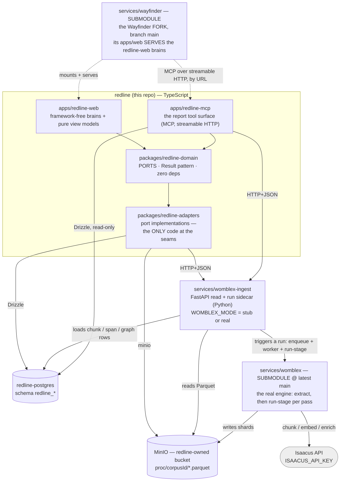
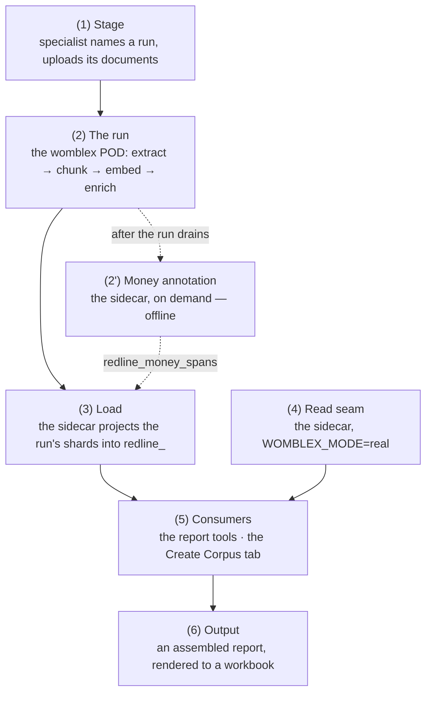

# redline — Architecture & Dataflow (target state)

> **Status:** ground-truth reference · supersedes the per-thread docs and the
> iteration delivery plans, all deleted. Durable design rationale that is not a
> single decision lives in [`design-principles.md`](./design-principles.md).
>
> This is the single source of truth for **what redline is, what it depends on,
> and how data moves through it**. redline is a corpus-ingest-and-report
> substrate: the Evaluation aggregate and the comprehension lens this document
> once described were removed on 2026-08-15. Its companion is
> [`delivery-plan.md`](./delivery-plan.md), the single source of truth for **what
> is left to build** — design lives here, tracking lives there, and neither
> restates the other.
>
> It is written against the *actual* behaviour of the upstream engines (womblex is
> vendored as a submodule at `services/womblex`, tracking the engine's latest
> `main`), not against aspiration. Where an earlier assumption proved false, the
> correction is stated plainly under **Corrections to earlier assumptions**.

---

## 1. What redline is

redline is a **corpus-ingest-and-report substrate**. A specialist stages a corpus
of documents from the browser, the womblex engine extracts, chunks, embeds,
enriches and prices it, and the chunks, money spans, enrichment graph and
extraction JSON that run lands serve two independent consumers: the fork's Create
Corpus UI, and `apps/redline-mcp`'s report tools.

redline is **not** a document-extraction engine, a classifier, or an embedding
model. It **composes two upstream systems** over runtime seams and owns only:

- the **ports** (the store-side query surfaces and the two engine seams);
- the **control surface** (naming a run, staging its bytes, firing it, watching it);
- the **report tool surface** (the same reads, served over MCP);
- its **own** MinIO bucket and Postgres schema.

Everything heavy — OCR, chunking, embeddings, enrichment, money recognition —
lives behind a seam in an upstream system or an external API. **Nothing here
models a judgement over a corpus.** The Evaluation aggregate and the comprehension
lens that once sat above these rows were removed in the pivot; interpreting what a
run landed belongs to a consumer, above the store. See
[`design-principles.md`](./design-principles.md) §2.

### The two upstream systems

| System | What it is | How redline consumes it |
|---|---|---|
| **womblex** (`services/womblex`, submodule @ latest `main`) | Python document-extraction pipeline: detect → extract → (redact) → chunk → (embed / enrich / pii), plus the offline **`money`** annotation op. Writes **Parquet shards** to object storage. | As a **worker pod** that lands shards in MinIO, plus a thin **FastAPI read sidecar** (`services/womblex-ingest`) that reads those shards and serves **JSON**. redline's TypeScript never links a Parquet reader. The sidecar also carries the **run trigger/status seam** and the **money-stage invocation** (`run_money_stage` / the `money` compose profile). |
| **Isaacus** (external SaaS API) | The Kanon model family: `kanon-2-embedder` (retrieval embeddings), `kanon-2-enricher` (entity/graph enrichment + AI chunking), `kanon-universal-classifier`, `kanon-answer-extractor`. | **Only** through womblex's chunk/embed/enrich stages. redline never calls Isaacus directly. Requires `ISAACUS_API_KEY`. |

---

## 2. The Isaacus boundary

Womblex's stages split cleanly into offline and Isaacus-gated:

| womblex stage | Needs Isaacus? | Produces |
|---|---|---|
| `detect` / `extract` | **No** — PyMuPDF + PaddleOCR/YOLO, all local | `*.elements`, `*.table_cells`, `*.form_fields`, `*._manifest` parquet |
| `redact` | No — local detector | `*.redactions.parquet` |
| **`money`** | **No** — offline, API-free amount recognition (v0.3.0) | **`*.money_spans.parquet`** (one row per amount, exact `Decimal` + currency) + `*.money_columns.parquet` (per-column verdict audit) |
| `chunk` (default) | **Yes** (v0.3.0) — but by a *pre-flight policy gate*, not by any API call: the stage refuses when no key is present even though `semchunk` sizes with a Kanon-2 tokeniser the engine vendors in-tree. See §7.1 | `*.chunks.parquet` |
| `chunk` (AI mode, `chunking.chunking_model` set) | Yes — enricher-driven boundaries | `*.chunks.parquet` (better boundaries) |
| `pii` | No — graph-driven (needs enrich) or a local MiniLM backstop | `*.pii_spans`, `*.clean_text` parquet |
| **`embed`** | **YES** — `kanon-2-embedder` via `client.embeddings.create` | **`*.embeddings.parquet`** |
| `enrich` | **YES** — `kanon-2-enricher` | `*.enrichment_*`, `*.graph_edges`, `*.entity_links` parquet |

**Consequence for redline's read surface (settled 2026-07-27):**
every store-backed read redline serves is over chunk rows, and the chunk *and*
embed stages are Isaacus-gated. Therefore:

- **A usable corpus requires `ISAACUS_API_KEY`.** Without it, `chunk`/`embed`
  never run, no chunk rows land in the store, and there is nothing to read. This
  is a hard dependency, not a degraded mode. A run over the offline stages alone
  (extraction plus `money`) still exercises the whole browser → object store →
  engine → tracker path, which is why the e2e suite splits on it.
- **Air-gap / offline operation is a non-goal for redline.** Earlier docs carried
  an "Isaacus-optional / air-gapped" posture (a hangover from womblex's own edge
  modes and Wayfinder's air-gap validation). redline does not pursue it — a
  deployment that cannot reach Isaacus cannot land the chunks every read is over.
  Settled 2026-07-27; the
  `EnrichmentMode.OFFLINE` machinery, the air-gap tests and the Isaacus on/off
  toggle have been removed.
- The only genuinely offline concern is **redline's own infra** (its MinIO/Postgres
  are its own, config-driven, never a hardcoded Wayfinder endpoint).
  That is unrelated to the Isaacus dependency.
- **Chunking is also Isaacus-gated (v0.3.0) — by policy, not by capability.** An
  earlier revision recorded the default chunk stage as offline; a later one blamed
  an API-only tokeniser. Both are wrong: the engine refuses the whole stage without
  a key (a network-free pre-flight check) while vendoring the Kanon-2 tokeniser
  in-tree. The practical effect is unchanged — chunks *and* embeddings both require
  `ISAACUS_API_KEY`, and only `extract`/`table_cells`/`redact`/`money` are offline —
  but the reason matters for any upstream conversation. See §7.1.

---

## 3. Component map



**Reading the map.** Each layer, and what the diagram compresses:

- **`apps/redline-web`** — the control surface: naming a run, staging its
  documents, authoring the allow-listed config, firing the run and tracking it,
  plus the **report sheet seam** (`report-export.ts`) that renders an assembled
  report (§5.1) to a workbook through a `write-excel-file` writer. Served by the
  forked Wayfinder; **no Wayfinder imports leak back** into these packages — the
  assembled-report shape the seam consumes is declared redline-side, so the loop's
  output crosses as plain data.
- **`apps/redline-mcp`** — the **report tool surface**: the same read ports, served
  as an MCP server so a report-assembler LLM can call them. See §5 invariant 7 for
  what it does and does not expose. It is a *process with a URL*, not a library —
  Wayfinder's MCP client speaks SSE and streamable HTTP only (no stdio) and
  addresses servers by URL, so it cannot live in `redline-adapters` (a library) and
  must not live in the fork (which would make redline's own store reachable only
  through Wayfinder).
- **`packages/redline-domain`** — no entities, only ports:
  `IProcurementExtractionReader`, `IChunkStore`, `IMoneySpanStore`, `IGraphStore`,
  `IStagedCorpusReader`, `IStagedCorpusWriter`, `IWomblexRunTrigger`, plus the
  `RunConfigOverride` smart constructor. There is nothing above them to model: a
  corpus is a womblex run, and the rows are the run's.
- **`packages/redline-adapters`** — each seam is "as if C":
  `womblex/` speaks HTTP+JSON to the sidecar (read + trigger + status),
  `storage/` speaks S3 to redline's own bucket, `persistence/` Drizzle to
  `redline_` Postgres — including the `DrizzleChunkStore`, `DrizzleMoneySpanStore`,
  `DrizzleGraphStore` and `DrizzleStagedCorpusReader` readers over the four tables
  the sidecar's load path writes (the sidecar writes them; these adapters read
  them — see §4/§5).
- **`redline_chunks`** is the chunk store, **written by the sidecar's ingest**:
  chunk rows + provenance + the embedding as data, plus the element range each
  chunk was cut from (`startChar`/`endChar` for a narrative chunk,
  `elementOrder` for a table chunk — chunk element addressing). Pure
  `resolveChunkForMoneySpan` (`persistence/`) resolves a money span to the one
  chunk containing it from there, given the candidate chunks a caller already
  fetched; a `sheet_cell` span always resolves to none — a spreadsheet-sheet
  chunk carries no single anchor element to match against.
- **`services/womblex`** is built from its **own** Dockerfile and run through its
  **own** cloud runner (Postgres job queue, scalable worker, native S3 staging).
  Its `chunk`, `embed` and `enrich` stages reach Isaacus.
- **The `money` op runs on demand like any other stage** (`run-stage --stage
  money`, the `stage` compose profile): it stages a corpus's shards down, runs
  womblex's `money_shards()`, and publishes `*.money_spans` / `*.money_columns`
  back — offline, no Isaacus. See §4 step (2').

**The fork (`services/wayfinder`).** Its `apps/web` serves the redline-web brains
and view models inside Wayfinder's chrome, auth and router, resolving `@redline/*`
as workspace packages (`../../apps/*`, `../../packages/*` globs) exactly as it
resolves `@rbrasier/*`. **The mount lives only here**, never in redline's tree;
`validate.sh` #12 keeps the checkout on the branch `.gitmodules` names.

As built: the `corpus` tRPC router (`staged` / `stagedDocuments` /
`create` / `runStatus` / `resumeRun`); `container-redline.ts`
(`buildRedlineModule` → `CorpusController` behind
`ctx.container.redline.corpusController`); and the `/create-corpus` route, whose
`"use client"` surface renders the view models. The route gates in the page as
well as in the procedure, calling `notFound()` without the key, because the
sidebar entry pointing at it is hidden by the same rule. The controller's three
ports cross `container-redline`'s boundary as **injected** dependencies;
`resolveRedlineModule` binds them to their production adapters from `REDLINE_*`
config, and with `REDLINE_DATABASE_URL` unset it returns null and the fork boots
as plain Wayfinder with the mount unavailable, so redline's absence never fails
Wayfinder's fail-fast env parse. Running both stacks locally is
[`guides/two-stack-local-run.md`](./guides/two-stack-local-run.md).

**Three test layers, not two.** The brains and view models are proven
framework-free under `apps/redline-web/`; the Playwright specs prove the served
route, with the half that fires a real run gated on a reachable sidecar and object
storage. Between them, the fork's own vitest suite mounts the `"use client"`
component under jsdom against a fake `trpc` query, so a break in the core→DOM
binding fails without a browser or a corpus.

**One key.** `corpus:create` gates the whole surface — naming a run, staging its
bytes, firing it, and listing what previous runs staged. It replaced the
`evaluation:create` / `evaluation:review` split 1:1 with what `evaluation:create`
already gated, since the review half went with the Evaluation surface.

**A corpus's id is its run's name.** redline mints nothing. The same string the
specialist types on Create Corpus names the womblex run, addresses the corpus in
object storage (`proc/{corpusId}/`), and keys `redline_chunks`,
`redline_money_spans` and the graph tables, as well as the sidecar's read routes
(`/extractions/{corpus_id}/{document_id}`). One identity, consumed rather than
curated — see [`design-principles.md`](./design-principles.md) §2.

> **Naming note.** Those columns and the TypeScript fields over them are still
> spelled `evaluation_id` / `evaluationId`. They name a corpus, and always did;
> renaming them is a coordinated TypeScript/Python/SQL change with its own
> migration, tracked in [`delivery-plan.md`](./delivery-plan.md).

### Why womblex is split into a pod + a sidecar

- **The engine** (`services/womblex`, the submodule) is heavier than the API
  layer: PyMuPDF, OCR (`engine: paddleocr`, implemented by `rapidocr-onnxruntime`),
  YOLO layout, the Kanon tokeniser, model weights (multi-hundred-MB). It **can**
  run from its own image, built from the submodule's `Dockerfile`, so its
  lifecycle and resource profile *can* be decoupled from the API layer when a
  deployment wants that. It **is not required to be** — co-locating the engine and
  the sidecar on one appropriately-sized host is a valid topology (the sidecar
  image is `python:3.12-slim`, inside womblex's own 3.11/3.12 support, so the
  engine installs alongside it). Its only seam to the rest of the stack is
  **object storage** either way — it writes shards, nothing reads back
  into it. redline does not wrap the engine: batching, retry, horizontal scale-out
  and staging are the engine's own (`cloud/worker.py`, `store/remote.py`), driven
  through its `enqueue` / `worker` CLI, and are there to be used *if* the corpus
  justifies scaling out — not a precondition for running at all.
- **The sidecar** (`services/womblex-ingest`) is a lightweight FastAPI app that
  **reads** the engine's Parquet shards from object storage and serves them as
  JSON so redline's TypeScript never links a Parquet reader.
  `WOMBLEX_MODE` selects `stub` (a deterministic, dependency-free test double for
  fast CI + the adapter contract) or `real` (reads the engine's actual shards).
- **Whether the engine and sidecar are one deployment or two** (a one-shot job, a
  scaled worker fleet, a co-located process) is a **deployment choice, not a code
  choice** — the seam is object storage, and what backs that storage (an S3
  bucket, or an AWS-managed equivalent) is itself config. The code
  is architected to make co-location *possible*, not to *require* a shared local
  filesystem.

---

## 4. End-to-end dataflow



**(1) Stage.** The Create Corpus tab names the run, and `IStagedCorpusWriter`
puts each chosen document's bytes under `proc/{corpusId}/inputs/` in redline's own
bucket — the prefix the womblex runner reads its input from. Staging is bytes
only: womblex mints each document's `source_hash` when it extracts, so there is
nothing to describe about a document until the run has drained.

**(2) The run — the womblex pod.** `IWomblexRunTrigger` fires the pass sequence
the form authored against the config it authored, and the tracker polls it to a
terminal state. Over the corpus's documents:

| Stage | Output | Gate |
|---|---|---|
| `womblex extract` | `*.elements` / `*.table_cells` / `*.form_fields` / `*._manifest` | — |
| `womblex chunk` | `*.chunks.parquet` | Isaacus-gated (a policy refusal — §7.1) |
| `womblex embed` | `*.embeddings.parquet` | only with `ISAACUS_API_KEY` |
| `womblex enrich` | `*.enrichment_*` / `*.graph_edges` parquet | only with `ISAACUS_API_KEY` |

redline **drives and observes** the run; it does not reimplement the engine's
batching, retry or scale-out, and resume is re-firing the same trigger (the
engine's enqueue is idempotent and completed stages skip on their published
outputs), not resume logic of redline's own.

NB: `womblex run`/`worker` persists **extraction shards only** — it computes
chunking when `chunking.enabled` and then discards it, because
`operations/persist.py` hands `write_results` just the extraction. Every
downstream pass is therefore a separate one over the run's shard prefix, and
`womblex run-stage` is that pass: it lists one sidecar class, stages a
unit down, calls the unchanged `*_shards()` and publishes the declared outputs
back — all of them or none. It covers normalise, spellfix, chunk, money, enrich,
embed, link, pii, graph-refresh and quality; ordering between them is the
caller's, and the sidecar orders `enrich` before `chunk` whenever a chunking
model is resolved. All shards land under `proc/{corpusId}/`
(`batch-NNNN.<role>.parquet`). `source_hash` (SHA-256 of the source bytes) is the
document identity throughout.

**(2') Money annotation — the sidecar, on demand (v0.3.0).** Not part of `womblex
run`/`worker` (offline, API-free, no ordering dependency), so it runs after a run
drains — the same lifecycle as `womblex finalize`. `womblex money --shards` takes
a *local* dir but the shards live in object storage, so
`services/womblex-ingest/.../money_stage.py` (`run_money_stage`) is the stage-in /
run / stage-out step: it downloads each batch's `*.elements` + `*.table_cells`,
runs womblex's own `money_shards()` (config sourced from
`infra/womblex/redline.yaml` via `WOMBLEX_CONFIG` — the tuning is never restated),
and publishes `*.money_spans.parquet` + `*.money_columns.parquet` back under
`proc/{corpusId}/documents/`. Runnable via the `money` compose profile
(`compose --profile money run --rm money --evaluation-id <id>`), whose image is
built from the repo root by `infra/docker/womblex-money.Dockerfile` — it installs
the engine from the `services/womblex` submodule source, the only installable form
the engine has (it publishes no release). The read-seam sidecar keeps
its own light, womblex-free `sidecar` Dockerfile.

Publishing is not the last step: `run_money_stage` then **loads** the spans into
`redline_money_spans` off the same scratch dir
(`money_span_store.py` → `money_span_store_postgres.py`, wired when
`REDLINE_DATABASE_URL` is set), which is what makes them readable through
`IMoneySpanStore`. **The span lands uninterpreted** — womblex's
`MONEY_SPANS_SCHEMA` copied across column for column, all **three loci**
(`narrative` character offsets, `table_cell` and `sheet_cell` anchors, exactly one
anchor group non-null per row and `locus` discriminating), the qualifiers womblex
refuses to fold into `value` (`modifier`, `multiplier`, `negative`) and the
`range_group`/`range_role` pairing of a range's endpoints. These are *financial
expressions*, not prices: what a span belongs to, what it rolls up to and whether
it is a price at all are readings, and every reading belongs above the store. A
writer that decided any of them would need a second writer for the next
financial-data type. No span id is stable across a re-annotation, so a load
**replaces** the corpus's spans rather than upserting them — at corpus scope, not
per document, because a document can re-annotate to *zero* spans (add a veto term
and a column stops being money) and a per-document replace would never visit it,
leaving a figure readable that no longer exists. A corpus with no sidecars at all
is left untouched: that is "the stage never ran here", not "it found nothing".

**(3) Read seam — the sidecar (`WOMBLEX_MODE=real`).**

| Route | Behaviour |
|---|---|
| `POST /ingest` | reads the pod's shards, maps womblex's schema → the JSON read model, writes `{source_hash}.extraction.json` + `.embeddings.json` beside the shards (durable across restart), **and** — when a `redline_` DSN is wired — projects each document's chunk rows + embeddings into `redline_chunks`, addressable by provenance |
| `GET /extractions/{eval}/{doc}` | `{ documentId, elements[], chunks[], tableCells[] }` |
| `GET /embeddings/{eval}/{doc}` | `{ documentId, model, dimensions, vectors[] }` |
| `POST /embeddings/query {text}` | `{ model, dimensions, values[] }` (query vector) |
| `POST /runs {evaluationId, stageSequence}` | the run-trigger seam (§5 invariant 2): fires the fixed CLI sequence, then projects the run's shards into `redline_chunks` (the same load `POST /ingest` drives) on completion, and returns a `runId`. Wired only when the engine's queue DSN + store URI are configured; else the route reports unavailable |
| `GET /runs/{runId}` | `{ runId, evaluationId, phase, completedStages[], failedStage, resumable, error }` — the status a poller binds to |
| `POST /runs/{runId}/resume` | re-fires the run (idempotent enqueue + skip-on-output) |

Extraction provenance stays JSON. Bulk vectors do **not** cross to
TypeScript: at real corpus scale (~90k chunks) they are loaded into the
`redline_` store as data and queried in place through `IChunkStore`, superseding
the earlier embeddings-as-JSON path. The `/embeddings` JSON routes remain for the
query-embed seam and small reads. The embeddings are loaded and addressable, but **not yet under a similarity
index** — pgvector/ANN and `findSimilar` are deferred.

**(4) Consumers.** Two, independent of each other, over the same rows:

- **`apps/redline-mcp`'s report tools** — the store-backed reads (chunks, money
  spans, the enrichment graph) plus the extraction reads, served over MCP so a
  report-assembler LLM can navigate them. See §5 invariant 7 and §5.1.
- **The Create Corpus tab** — `IStagedCorpusReader` lists what previous runs
  landed, with an opening-passage preview so an opaque womblex `source_hash` is
  recognisable. It is deliberately not on `IChunkStore`: that port is the
  provenance-addressed fetch over a corpus that exists, and this one answers the
  question asked before there is one.

**(5) Output.** An assembled report (§5.1) crosses to `report-export.ts` as plain
data and renders to a workbook: a graph-availability header, then each section in
report order, every transferred passage keeping its `chunkId` citation and every
financial expression keeping its exact value, currency and provenance anchor.
Passage text stays byte-identical (a plain text cell, never re-parsed) and a value
stays uninterpreted (never re-read as a number cell), so a specialist opening the
workbook can resolve every fact back to a source location.

**(6) Provenance, followed.** Every citation a report carries resolves. The
extraction reads go back through `IProcurementExtractionReader` — the same JSON
presentation seam the rest of the read path uses, so no Parquet reader is linked —
and the chunk re-fetch is exact, by the `chunkId` the passage cited. A cited
element the extraction no longer carries is reported as such rather than silently
returning something adjacent, which would read as "this is the cited passage" when
it is not.

### The join keys (womblex's real schema — see `services/womblex/docs/extraction.md`)

- **Document identity:** `source_hash` (SHA-256 of source bytes). redline's
  `documentId` == `source_hash`.
- **Element provenance:** `elem_order`, `page`, `text`, `kind`
  (`paragraph`/`heading`/`table`/`form`/`image`/`sheet_cell`/…).
- **Table cells:** children of `kind='table'` elements, joined on
  `(source_hash, parent_elem_order)`. Columns are `row`, `col`, `value`,
  `value_type` — **there is no `is_currency` boolean**; currency is inferred from
  `value_type`.
- **Chunks:** `chunk_index` (0-based per `source_hash`), `text`, `content_type`
  (`narrative` | `table`), `start_char`/`end_char`, nullable `page_start`/`page_end`.
  Chunks join to elements by offset-range overlap, **not** by `elem_order`.
- **Embeddings:** joined to chunks on **`(source_hash, chunk_index, content_type)`**
  in womblex's own store. Columns: `model`, `task`, `dim`, `vector` (float32 list).
  `task` is `retrieval/document` for chunk vectors and **must** be `retrieval/query`
  for query vectors. Note `chunk_index` is a **single monotonic per-document
  sequence spanning narrative *then* table chunks** (womblex re-sequences the
  concatenated list), so `(source_hash, chunk_index)` is already unique across
  content types — the third key never disambiguates a collision (see §7).

redline's JSON wire shape (the sidecar's `records.py` / the domain DTOs) uses
`chunkId = "{source_hash}:{chunk_index}"` and L2-normalises vectors so a
consumer's cosine similarity is a dot product. `content_type` is
carried as provenance, not as part of the join key (see §7).

---

## 5. Seams & contracts (the invariants that must hold)

1. **Parquet→JSON is one-directional and lives in one place.** Only
   `services/womblex-ingest` understands womblex's Parquet schema. It maps
   `source_hash`/`elem_order`/`chunk_index`/cells/vectors into camelCase JSON
   DTOs. The TypeScript adapters are thin, allocation-only mappings.

2. **Object storage is the only seam to the womblex engine.** The engine writes;
   the sidecar reads. Neither imports the other — which is what keeps them
   *separately deployable and freely co-locatable*: the coupling is a storage API
   (S3-shaped), never an in-process link, so the same code runs whether the two
   share a host or not, and what backs the storage (an S3 bucket or an
   AWS-managed equivalent) is config.

   **redline's own write into that bucket is a staging write, not an engine
   seam.** `IStagedCorpusWriter` / `MinioStagedCorpusWriter` is redline's first
   write-side object-store port — every other object-store port is a read. It puts
   a specialist's chosen bytes under `proc/{evaluationId}/inputs/`, the prefix the
   engine's runner resolves its input from, so a browser upload reaches a run
   without a terminal `mc cp`. It stages bytes only: womblex still mints the
   `source_hash` identities when it extracts, and redline reads nothing back from
   this path until the run drains.

   **The run trigger is the second engine seam, and it is built.** Until it,
   object storage was the *only* coupling to the engine. `IWomblexRunTrigger` /
   `HttpWomblexRunTrigger` adds the second: a trigger into the engine's job queue
   and a read of run state, over the sidecar's `POST /runs` / `GET /runs/{runId}`
   / `POST /runs/{runId}/resume` JSON endpoints. The sidecar's `run_trigger.py`
   owns the sequencing — it fires the fixed CLI passes the seed script's operator
   fires by hand (`enqueue` + `worker` for extraction, then `run-stage --stage
   {chunk,embed,enrich,money}` in the caller-authored order) against the
   UI-authored config, layering the current downstream stage on top of
   `womblex_jobs` (which tracks extraction batches only) for the status read. On
   completion it drives the **same load `POST /ingest` drives** — projecting the
   run's published shards into `redline_chunks` via `chunk_store.load_extraction`
   — so the corpus a browser-fired run produces is visible to `IStagedCorpusReader`
   with no separate `POST /ingest` in between; that is the join the two-screen
   flow needs. The load runs only after every stage completed and fails the run
   loudly on a store error. The
   allow-listed stage *sequence* is authored; the dependencies are enforced
   sidecar-side. Those are: chunk before embed, always; and — whenever the
   effective `chunking.chunking_model` is set, which `infra/womblex/redline.yaml`
   now makes the corpus default — **enrich** before chunk, so semchunk reuses the
   Document enrich persists rather than self-enriching at double cost, followed
   by a **`graph-refresh`** pass after chunk. That third stage is not authorable
   and not optional: enriching first necessarily writes the graph before any
   chunk exists, leaving every mention at `chunk_index = -1` with no
   mention→chunk edges, and the refresh rebuilds them offline from char offsets
   both sidecars already carry (womblex `analyse/graph_refresh.py` — API-free and
   idempotent). Without it the AI-chunking ordering would buy coherent chunks by
   breaking the graph traversal invariant 7 depends on. What does **not** change: redline still does not
   reimplement batching, retry or scale-out — those stay the engine's
   (`cloud/worker.py`, its Postgres queue). redline drives and observes; it does
   not wrap. Resume is not its own logic: womblex's `enqueue` is idempotent on
   `(run_id, batch_num)` and completed `run-stage` bases skip on their published
   outputs, so re-firing the same run picks up where it stopped. The trigger is
   wired only when the engine's queue DSN + store URI are configured; absent, the
   sidecar is a read-only seam and the `/runs` routes return unavailable.

3. **Embeddings are loaded into the store as data and never cross to TypeScript.**
   At real corpus scale bulk vectors are projected into `redline_chunks`
   (`embedding jsonb` + `embedding_model`, L2-normalised, keyed on the stable
   `chunkId`), addressable through `IChunkStore` but returned as *rows*, never raw
   vectors — `redline-domain` stays vector-free. Vectors from different
   models are incomparable, so a future similarity match must compare like model
   with like; the vector is present but not yet under a similarity index —
   `pgvector`/ANN and `findSimilar` are deferred. This supersedes the earlier
   embeddings-as-JSON seam, which carried vectors across to TypeScript.

4. **Nothing above the store interprets a row.** redline serves what a run
   landed, as the run wrote it. A money span crosses with its exact value,
   possibly-unresolved currency and the qualifiers womblex refuses to fold in; a
   chunk crosses byte-identical. Every reading — what a span is for, what it rolls
   up to, whether it is a price at all — belongs to a consumer, above the store. A
   writer that decided any of them would need a second writer for the next
   data type.

5. **redline owns its infra.** Its MinIO bucket and Postgres schema are its own,
   config-driven, never a hardcoded Wayfinder endpoint. Wayfinder is consumed
   read-only and materialised from a pin.

6. **The report tools expose ports, and expose them uninterpreted.**
   `apps/redline-mcp` serves ten read tools — the deterministic reads
   `IChunkStore.fetchChunks`/`fetchByStructure`,
   `IMoneySpanStore.fetchByDocument`/`fetchByStructure`,
   `IProcurementExtractionReader.readElements`/`readChunks`/`readTableCells`, and
   the three graph-traversal reads
   `IGraphStore.fetchEntities`/`fetchEdgesFrom`/`fetchEdgesTo` — over
   **streamable HTTP**, because Wayfinder's MCP client speaks SSE and
   streamable-HTTP only (no stdio) and addresses servers by URL.

   It is hand-built rather than `postgres-mcp` because the ports encode a contract
   a `SELECT` does not: **stable ordering**, so a report assembled twice is the same
   report; **verbatim text**, byte-identical, because that byte-identity *is* the
   provenance claim; and a projection that is exactly the domain row, so
   `redline_chunks.embedding` is never selected (one `SELECT *` at ~90k chunks
   drags every vector across). Each payload reports `returned`/`available`/
   `truncated`, so the row cap protecting the assembler's context is visible rather
   than looking like the whole answer. `postgres-mcp` is still worth having for
   ad-hoc analysis, off this path.

   **The surface is built to its full shape, not to whatever is currently switched
   on.** The deterministic tools are exact fetch by key and structural fetch by
   provenance; **graph traversal is built alongside them** (`IGraphStore` →
   `DrizzleGraphStore` over `redline_graph_entities` / `redline_graph_edges`,
   mirroring womblex's `enrich` sidecars). It is the report assembler's navigation
   mechanic: an entity mention → its `mentioned_in` edge → the chunk it
   names → the verbatim passage read back through `fetchChunks`. The graph *locates*
   source rows; the transfer itself stays an exact chunk fetch, and it is **not**
   vector search. Whether a graph has been loaded, or a similarity index exists, is
   a *runtime* condition, not a build-time one: a graph tool whose corpus has no
   graph loaded returns an explicit `graphAvailable: false` — it is never dropped
   from the surface, and an empty match over a *loaded* graph is distinguished from
   an absent one so the assembler cannot mistake the two. That distinction is drawn
   by `IGraphStore.hasEntities`, a bounded existence probe (`LIMIT 1`, unordered)
   consulted only when a traversal came back empty: the answer is a boolean, and
   reading a corpus's entity rows to count them would be the same unbounded
   read the row cap above exists to prevent. An assembler that cannot
   ground a section in retrievable data reports what it could not reach rather than
   writing the section anyway. Deriving the tool surface from a config flag is how
   an earlier revision of this section came to assert "no graph" while
   `enrichment.enabled` was `true` and a run had already produced 1,771 edges. The
   one thing deliberately absent is `IChunkStore.findSimilar`, which refuses with
   NOT_IMPLEMENTED until the pgvector/ANN index lands. And **money crosses
   uninterpreted**: an exact decimal `value`, a possibly-unresolved `currency`, and
   the qualifiers womblex refuses to fold in.

   In Wayfinder it registers with **`communicatesExternally: false`**. The flag
   classifies whether a server talks *outside* Wayfinder; this one reads redline's
   own Postgres inside the same deployment and sends nothing anywhere. That it reads
   commercial-in-confidence documents is a concern about the data, not about egress,
   and it is what the `false` branch governs — an internal utility under the
   document human-review gate. `true` would register the server but make it **not
   selectable in flows**, which would make the assembler unbuildable.

7. **A corpus prefix holds many runs; a reader must select one.** The engine
   publishes under `proc/{corpusId}/runs/run-<timestamp>/documents/`, and a
   re-run adds a directory rather than replacing one — the engine's
   `processing.retention` policy governs its own output root, not this prefix. So
   `proc/{corpusId}/` accumulates N copies of every shard class, and any
   reader that discovers shards by suffix across the whole prefix returns each row
   N times. The run id is the selector: the stage runner already takes
   `--run-id`, and every read seam needs the same.

   **This invariant is currently violated.** `RealWomblexExtractor.extract` lists
   the whole prefix and concatenates by suffix, so served extractions carry
   duplicated elements and a `elementOrder` that no longer identifies one element.
   Tracked in the delivery plan; recorded here because the invariant is the
   durable half and the fix must not be re-derived.

---

## 5.1 What a report is

**The report is the product.** A corpus that is merely extracted and chunked is
womblex — almost none of that is redline. redline is for the step after: assembling
those addressable, provenance-tagged facts into a document a procurement specialist
hands to a delegate. This section settles what that document *is*, so the assembly loop
can be built and tested against a definition rather than an intuition. Nothing here
is a rendering concern (that is §2's report-sheet seam); this is the *shape and the
rules*.

**A report is an ordered list of sections, each grounded in the store.** A section
is `{ heading, body, citations }`. The **assembler LLM chooses** the heading, the
ordering and the connective prose of the body — the narrative that frames the
facts. It **does not author facts**: every load-bearing claim in a body is either a
**transferred passage** (a chunk's text, copied byte-identical from the store) or a
**financial expression** (a money span, carried with its exact `value`, `currency`
and qualifiers as womblex wrote them). A `citation` names the store row a
transferred passage or expression came from — `chunkId` for a passage, the span's
provenance anchor for an expression — so every fact in the report resolves back to
a source location the specialist can open. A section with a body but no citations
is a defect: it is prose the assembler wrote unaided, which is exactly what the
verbatim rule exists to prevent.

**The verbatim rule is the testable core, and it is the provenance claim.** A
transferred passage must be **byte-identical to the chunk it came from** — not
paraphrased, not trimmed, not re-cased, not re-quoted. This is asserted directly
against the store (the assembly loop's exit test re-fetches every cited `chunkId`
and compares bytes), never eyeballed. The reason is not fastidiousness: redline
sells provenance, and a passage that has been silently reworded no longer
resolves to the source — the deep-link would land on text the report does not
contain. The assembler may *quote a fragment* of a chunk, but a quoted fragment
must be a contiguous substring of the stored chunk, so the byte-comparison still
holds. Summarising or characterising a passage is the assembler's own prose and
lives in the connective body, never presented as a transferred fact.

**How the assembler reaches its facts.** It is pointed, not left to roam. The
pointing comes from structural fetch (a document's chunks by provenance) and from
the graph (§5 invariant 6: entity → `mentioned_in` edge → chunk). There is no
similarity search on this path (`findSimilar` is deferred), so the assembler
transfers facts it is directed to rather than discovering them. **When it cannot
ground a section in retrievable data it says so** — a section whose supporting graph
or spans are absent is reported as *unreachable* (a user-facing note naming what it
could not reach), never written anyway from the model's own knowledge. A run over a
corpus with no graph loaded therefore produces a report with an explicit
unavailability, not a silently thinner one.

**What a specialist can change before export.** A report is a **draft the
assembler proposes**, and the specialist is the author of record. Before export
they may: reorder sections; edit or delete a section's heading and connective body;
and **remove** a transferred passage or a whole section. They may **not** silently
edit the text of a transferred passage — doing so would break the byte-identity the
citation asserts, so a passage is either kept verbatim (with its citation) or
removed (and its citation with it). Adding a *new* transferred passage means citing
a store row, so the same rule holds by construction. This keeps the specialist in
control of the report's shape and voice while the provenance guarantee stays
mechanical: every passage still present in the exported report is still
byte-identical to a stored chunk.

**What a report is not.** It is not a scoring or a recommendation — redline does not
rank vendors or decide a tender, and a quality score is a non-goal
(`design-principles.md`). It is not a fixed template: the sections are the
assembler's, shaped by what the corpus actually addresses, so a document that
answers nothing surfaces as a section that says so rather than being forced into a
heading it does not fill.

---

## 6. Repository layout

```
redline/
├── apps/redline-web/              control surface (TypeScript) — the Create
│                                  Corpus brain, the run-status view models, and
│                                  the report sheet seam (report-export.ts): an
│                                  assembled report (§5.1) → a workbook, rendered
│                                  deterministically through write-excel-file
├── apps/redline-mcp/              the report tool surface — ten read tools served
│                                  as an MCP server over streamable HTTP (the
│                                  deterministic chunk/money/extraction fetches plus
│                                  IGraphStore traversal), plus its Dockerfile
│                                  (compose profile `report`)
├── packages/
│   ├── redline-domain/            ports only (zero deps, Result pattern)
│   ├── redline-adapters/          port implementations (the only code at the seams)
│   └── redline-shared/            shared kernel
├── services/
│   ├── womblex/                   ◄ SUBMODULE: the real womblex engine @ latest main
│   ├── womblex-ingest/            FastAPI read + run sidecar (MinIO Parquet → JSON)
│   │   ├── src/womblex_ingest/    stub + real extractor, records (wire shape),
│   │   │                          shard_reader (schema map), storage, embedding,
│   │   │                          chunk_store[_postgres] (the chunk load),
│   │   │                          money_stage (the `money` op invocation) +
│   │   │                          money_span_store[_postgres] (the span load),
│   │   │                          run_trigger (the run-trigger seam: fires the
│   │   │                          fixed CLI sequence, reads run state)
│   │   └── Dockerfile             the light, womblex-free `sidecar` image; the
│   │                          `money` image is infra/docker/womblex-money.Dockerfile
│   └── wayfinder/                 ◄ SUBMODULE: the Wayfinder FORK,
│                                  branch main. apps/web serves
│                                  the redline-web UI; resolves @redline/* as
│                                  workspace packages. Mount lives here only.
│                                  As built: server/routers/corpus.ts (tRPC:
│                                  staged / stagedDocuments / create / runStatus /
│                                  resumeRun), lib/container-redline.ts
│                                  (buildRedlineModule → CorpusController), the
│                                  app/(user)/create-corpus route and its
│                                  "use client" surface, the sidebar Create Corpus
│                                  entry, the corpus:create auth gate and the
│                                  served-fork Playwright spec.
├── infra/
│   ├── docker-compose.yml         profiles: ingest | money | womblex |
│   │                              womblex-cli | stage | redline | report
│   ├── docker/                    repo-root-context Dockerfiles built by compose
│   │                              (womblex-money.Dockerfile — the `money` image)
│   └── womblex/redline.yaml       redline's pipeline config for the engine
├── docs/
│   ├── architecture.md            ◄ THIS FILE — what redline IS (the design truth)
│   ├── delivery-plan.md           what is LEFT TO DO (the tracking truth)
│   ├── design-principles.md       adopted principles + non-goals (durable, not tracking)
│   ├── guides/                    local dev, validation, two-stack run
│   └── reviews/                   dated point-in-time reviews (historical record)
├── scripts/                       vendor-wayfinder, womblex-pod smoke, etc.
├── vendor/wayfinder/              materialised from services/wayfinder (never committed)
└── validate.sh                    the CI gate
```

### Vendoring / pinning discipline

**One pin per dependency, and the gitlink is it.** All three upstreams are git
submodules, so each already records exactly one commit. redline adds no second
declaration of that commit anywhere — no pin file, no version string to keep in
step by hand. A copy of a SHA is a thing that can drift; a gitlink cannot drift
from itself.

**The policy is latest, not a held-back pin.** redline consumes its engines for
capabilities it does not reimplement, so lagging one means either going without a
capability or growing a redline-side substitute for it — the exact duplication
the submodule discipline exists to prevent. "Latest" is a rule about which commit
we move the gitlink to, not a floating ref: move it forward to upstream `main`,
and do not sit on an older commit to avoid a bump.

- **womblex** — `services/womblex`, currently `d6850de` (declared version
  `0.4.0`), which is `origin/main`. The engine publishes no release to any index,
  so the submodule source is the only installable form: every image that needs it
  does `pip install ./womblex-engine[...]` off this tree
  (`infra/docker/womblex-money.Dockerfile`). The sidecar declares no engine
  dependency, so there is nothing to keep in step with the bump.

  An earlier pin (`f283969`) was an untagged commit taken ahead of `v0.3.0` for
  `womblex run-stage` — without it no path in redline produced chunks at all, and
  a corpus run completed leaving `redline_chunks` empty with nothing failing.
  That situation is closed: `run-stage` is in the released line and the submodule
  has moved past it.

- **Wayfinder** — `services/wayfinder`, tracking branch `main`. Unlike the
  byte-identical womblex submodule this is one redline *runs and edits*: the
  Create Corpus UI mounts into the fork's `apps/web`, which resolves redline's
  `@redline/*` packages as workspace members. The invariant that replaces "never
  modified" is enforced by `validate.sh` #12: the checkout stays on the branch
  `.gitmodules` names. The check once also asserted the fork's `main` never
  diverged from rbrasier, protecting a clean upstreaming diff; redline builds
  against johntooth/wayfinder only, so that half was removed rather than left
  policing a relationship we do not have.

  Wayfinder is consumed at **two** seams but from **one** commit. The runtime
  UI-mount seam is the submodule itself. The build-time typed-reuse seam is
  `vendor/wayfinder`, which `scripts/vendor-wayfinder.sh` materialises *out of
  that same checkout* and which is never committed. The copy exists only because
  pnpm's workspace glob would otherwise absorb every package under the fork —
  dragging `@huggingface/transformers`, the OpenTelemetry SDK, minio, docx and
  pdf-parse into redline's install — so the script copies only the package we
  consume. It is a filter on *what* is vendored, not a second answer to *which
  commit*. redline typechecking against a domain package the fork had moved past
  is exactly what a second answer once caused.

---

## 7. Corrections to earlier assumptions

The per-thread docs and dev-iteration plans carried assumptions that the
vendored womblex source contradicts. Recorded here so they are not re-derived:

1. **Chunking IS Isaacus-gated (v0.3.0), but the gate is a policy refusal, not a
   capability limit.** Both earlier framings here were wrong in different
   directions, and reading the pinned engine settles it without a corpus run.

   **The gate is real and blocking.** `run_chunking` (`operations/chunk.py:35-41`)
   and `chunk_shards` (`process/chunk_stage.py:91-98`) each return early when
   `isaacus_available()` is false, writing no `*.chunks.parquet`. A run without
   `ISAACUS_API_KEY` therefore yields extraction shards **but no chunks and no
   embeddings** — not a usable redline deployment (air-gap is a non-goal; see §2).

   **But the reason previously given was wrong.** This section used to say the
   Kanon-2 tokeniser "is API-only (it is not on Hugging Face)". The engine
   **vendors it in-tree** at `src/womblex/_models/kanon-2-tokenizer/`
   (`tokenizer.json`, `vocab.json`, `merges.txt`), and `create_chunker` prefers
   that local copy via `resolve_local_model_path` (`process/chunker.py:152-160`)
   precisely so token counting is offline. `isaacus_available()`
   (`utils/availability.py:16-25`) is a network-free check for the `isaacus`
   package plus a non-empty key — it never attempts to load a tokeniser. So the
   skip is a **pre-flight policy check upstream applies to the whole stage**,
   including plain token chunking that needs no API call. The engine's own config
   comments (and `infra/womblex/redline.yaml`, since corrected) describe the
   chunker's real capability; the gate is what contradicts them. Relaxing it would
   be an upstream change request, not a redline fix — and redline needs the key for
   `embed` regardless, so nothing downstream turns on it.

   **Packaging is half of that check, and it is the half that bites.** Because
   `isaacus_available()` tests `find_spec("isaacus")` *before* it reads the key, an
   image built without the engine's `isaacus` extra is gated off while holding a
   perfectly valid `ISAACUS_API_KEY`: the run drains extraction, reaches `chunk`
   and fails there. Any image that serves a *run* must therefore install
   `womblex-engine[cloud,isaacus]`, not just `[cloud]` — which the run-capable
   sidecar did not, because it reuses the deliberately offline money image.
   `validate.sh` #15 holds those two lines together. The sidecar's own
   `/health` was no help there until it was taught the same check: it reported
   `isaacusEnabled: true` off the key alone.

   Operationally: `womblex run` persists only extract shards; `chunk` and `embed`
   are separate `--shards` commands. Note also that `run` still *computes* chunking
   in-batch when `chunking.enabled` (`batch.py:63-64`) and then drops it at write
   time — `write_batch_parquet` passes only `(doc_id, path, extraction)` to
   `write_results` (`operations/persist.py:18-27`), and `DocumentResult.chunks`
   never reaches a shard — so a keyed run does the work twice. `chunking.enabled:
   false` for the `run`/worker pass avoids it and is safe for `run-stage --stage
   chunk`, which ignores the flag entirely (absent from `process/chunk_stage.py`
   and the chunk `StageContract`); `womblex chunk --config` refuses outright when
   it is false (`cli/pipeline.py:417-419`), so do not flip it if anyone uses that
   form. **This stopped being free.** While redline set no `chunking_model`, the
   duplicate was wasted CPU/wall-clock only — `run_chunking` (`operations/chunk.py`)
   read `config.chunking.chunking_model` regardless of caller, so once
   `infra/womblex/redline.yaml` set one (semantically bounded chunks, on by
   default), the in-batch pass would have spent a real per-document Isaacus AI-
   chunking call and discarded it, then paid for it again for real in `run-stage
   --stage chunk` — the same double-charge shape as the enrich-ordering issue
   above, from an unrelated cause. `infra/womblex/redline.yaml` sets
   `chunking.enabled: false` for exactly this reason now.

2. **Retrieval requires Isaacus.** `*.embeddings.parquet` is produced only by
   `kanon-2-embedder` (Isaacus). redline's retrieval classification
   therefore requires `ISAACUS_API_KEY`. The "full pipeline runs offline" framing
   from the earlier air-gap work is retired: it was only ever true up to the chunk
   stage, and air-gap is not a redline goal.

3. **The embeddings join is three keys upstream, but the two-key `chunkId` is
   already unique — no collision exists.** womblex joins vectors to chunks on
   `(source_hash, chunk_index, content_type)`. An earlier revision recorded this
   as an **open finding**: that a document with both narrative and table chunks at
   the same `chunk_index` would collide under redline's two-key
   `chunkId = {source_hash}:{chunk_index}`. **A real 0.3.0 run falsifies that.**
   womblex assigns `chunk_index` as a single monotonic per-document sequence
   spanning narrative *then* table chunks (`process/chunker.py` re-sequences the
   concatenated list: `chunk_index = len(repaired)` — e.g. a real REOI is
   narrative 0–21, table 22–29). So `(source_hash, chunk_index)` is **already
   unique across content types**; the third key never disambiguates a real
   collision. `content_type` is kept as **provenance carried alongside a row**,
   not as part of the join key. No `content_type`-aware `chunkId` and no
   seam-identity change are needed. (Resolved.)

4. **Table cells carry no currency flag, and `value_type` cannot supply one.**
   womblex's `TABLE_CELLS_SCHEMA` is `(source_hash, parent_elem_order, row, col,
   value, rowspan, colspan, value_type)` — joined on `parent_elem_order`, with no
   page column. redline's `TableCellRecord.isCurrency` must be **derived**.

   An earlier revision of this section said to infer it from `value_type`. That is
   **falsified**: `value_type` was always `"text"` at the `v0.2.0` pin this note
   was first written from
   (`ingest/spreadsheet.py:13`, the only literal ever assigned in that engine's
   source), `number_format` is a column of `ELEMENT_SCHEMA` rather than of
   `table_cells` and is left unset, and that engine had no currency capability
   anywhere in `src/`. So `isCurrency` was derived from the **verbatim `value`
   string**, requiring an explicit currency marker — a bare number is not
   currency. Both columns are still read first, so a
   future openpyxl-based reader upgrades the signal with no redline change.

   **Superseded by the `money` op (v0.3.0), and now the real pricing leg.** The
   engine is at `v0.3.0`, whose `money` annotation op recovers currency-typed
   amounts directly — column-evidenced (a bare number whose money-ness comes from
   its header, ~98.7% of amounts) as well as self-evidencing — writing exact
   `Decimal` values and a resolved currency into `*.money_spans.parquet`. redline
   materialises those spans into `redline_money_spans` and serves them
   uninterpreted through `IMoneySpanStore`, replacing the
   `isCurrency`-at-the-seam derivation above; that derivation remains only as a
   fallback for shards produced without a money sidecar. The one upstream limit no
   config fixes: `classify_column` checks vetoes before money terms, so a bare
   `Hourly Rate` / `Day Rate` column (no currency in the header) yields nothing —
   an upstream change request, not a redline fix.

5. **There is no `womblex.embed_query` / public embedding helper.**
   `womblex/__init__.py` exports only a docstring and `__version__`. The real query
   embed path is `womblex.analyse.embed.embed_texts([text], isaacus_client, model=…,
   task="retrieval/query")`, with the client from
   `womblex.cli._shared.make_isaacus_client` — it cannot embed offline. The `task`
   matters and is redline's to choose: womblex's own default is
   `retrieval/document`, the *index* side, and a query embedded with it lands in a
   different space from the chunk vectors it is ranked against — degrading silently
   rather than failing. The `model` is read from womblex's own configuration
   (`EmbeddingConfig`, or the deployment's `redline.yaml` via `WOMBLEX_CONFIG`), never
   restated redline-side, so chunks and queries cannot drift onto different models.
   Built in thread 56.

6. **womblex does not wire the classifier/extractor models its README names.**
   This section previously said womblex *exposes* `kanon-universal-classifier`
   (zero-shot classification) and `kanon-answer-extractor` (structured field
   extraction).

   Reading the engine settles it: **neither model appears anywhere in womblex's
   source.** They are named only in its `README.md` (lines 237–238), in a passage
   describing what the *Isaacus platform* offers. womblex does not wire them, so
   consuming them would mean redline calling Isaacus directly — which §1 forbids.
   Recorded because the question resurfaces whenever the READMEs are read as a
   capability list.

7. **Three Isaacus-gated stages, not two — and only one is satisfied offline.**
   Earlier text framed the boundary as chunk-and-embed. `enrich` declares the same
   need (`kanon-2-enricher`), and it is now enabled in redline's profile. At the
   `chunking.chunking_model` unset default, `chunk` alone is satisfied by a
   placeholder key, because its tokeniser is vendored in-tree and it makes no
   call, while `embed` and `enrich` both spend against a real credential.
   **redline's own profile no longer sits at that default.**
   `infra/womblex/redline.yaml` sets `chunking.chunking_model: kanon-2-enricher`
   (semantically bounded chunks, on by default), so on redline's actual corpus
   runs `chunk` spends too — a placeholder key satisfies nothing here, and a
   deployment without a real Isaacus account gets extraction and nothing else.

8. **The column-evidenced money path contributed nothing on a native-text
   corpus — measured, not assumed.** The pricing design leans on womblex's finding
   that ~98.7% of its corpus's amounts are bare numbers whose money-ness comes
   from a column header. On the first real procurement corpus (2026-08-06,
   1 REOI + 3 responses) that path recovered **zero**: 42 columns audited, 38
   `insufficient`, 4 `vetoed`, none promoted, because no header carried money
   vocabulary at all. All 65 money spans came from prose with an explicit symbol.

   The reading is about corpus shape rather than the recogniser: these documents
   contain no priced tender schedule. It does mean the header/veto vocabulary in
   `infra/womblex/redline.yaml` is **unvalidated by measurement**, and that a
   corpus with real pricing tables is what would validate it.

9. **The OCR-table gates are unexercised on redline's own path.** All four
   documents of the first real corpus extracted `structured` via `native_text`,
   and all 7 tables were native, so the paddleocr-only, deskew-refusal and
   precision-refusal gates never executed. They guard the table-cell
   reconstruction that recovers pricing from scanned tenders — a real consequence
   — and remain unproven here until a scanned corpus runs.

---

## 8. Runtime & environment notes

- womblex requires **Python 3.11/3.12** (its OCR dep `rapidocr-onnxruntime` has no
  wheel on 3.10 or 3.13). The **sidecar image is `python:3.12-slim`** — inside that
  window — so nothing stops the engine being co-located with the sidecar
  (`pip install ./womblex-engine[cloud]` off the submodule, as the money image
  does). The engine **can** run from its own image for resource/lifecycle
  isolation (heavy OCR/YOLO/tokeniser/model runtime, its own cloud runner for
  scale-out), and **can** equally run co-located with the sidecar on one
  appropriately-sized host — the split is a deployment choice, not a code
  constraint. The one interpreter caveat that remains is that a developer's
  `validate.sh` box may run a *newer* interpreter (e.g. 3.13) that womblex's OCR
  wheel does not cover, which is why the engine-touching tests `importorskip`
  `womblex` rather than assuming it is present.
- The womblex-ingest sidecar's **real binding** decodes Parquet with `pyarrow`
  (light) — that half runs anywhere pyarrow resolves, independent of whether the
  engine is installed in the same environment. Producing the shards (and any query
  embedding) requires the engine and, for embeddings, Isaacus.
- `ISAACUS_API_KEY` is the single switch that turns the corpus on. Without it:
  extraction shards land, but there are **no chunks and no embeddings** (both the
  `chunk` and `embed` stages are Isaacus-gated), so nothing lands in the
  `redline_` store and there is nothing to read. redline treats that as a
  misconfiguration, not a supported mode (§2, settled 2026-07-27).

---

## 9. Where to look next

- **womblex's real schema & stages:** `services/womblex/docs/extraction.md`,
  `services/womblex/docs/dataflow.md`, `services/womblex/docs/architecture.md`
  (the submodule's own docs — authoritative for the engine).
- **The wire shape redline serves:** `services/womblex-ingest/src/womblex_ingest/`
  (`records.py` = DTOs, `shard_reader.py` = the schema map, `real_extractor.py`,
  `run_trigger.py` = the run-trigger seam behind `POST /runs` / `GET /runs/{id}`).
- **Outstanding work:** [`delivery-plan.md`](./delivery-plan.md) — the only
  document that tracks what is left to build.
- **Design rationale (durable, non-tracking):** [`design-principles.md`](./design-principles.md)
  — the composable-operations principles redline adopted from its upstreams and
  the non-goals it holds.
